# Coding-Arena

# Coding Arena
### The World's First Real-Time Competitive Coding Platform

**Startup Blueprint & Investor Prospectus**

| | |
|---|---|
| **Prepared for** | Founders, Co-Founders, Investors, and Development Team |
| **Document type** | Confidential Startup Blueprint (v1.0) |
| **Date** | July 2026 |
| **Status** | Pre-seed / Concept-to-MVP |

> *"Chess.com proved that a 1,500-year-old solitary board game could become a $150M-revenue, 250-million-user live spectator sport. Coding Arena is built on the same bet: that programming — practiced today mostly alone, in silence, against a blinking cursor — is one live opponent away from becoming a sport too."*

---

## Table of Contents

1. [Executive Summary](#1-executive-summary)
2. [Problem Statement](#2-problem-statement)
3. [The Solution](#3-the-solution)
4. [Market Research](#4-market-research)
5. [Competitor Analysis](#5-competitor-analysis)
6. [Unique Selling Proposition](#6-unique-selling-proposition)
7. [Business Model](#7-business-model)
8. [Product Roadmap](#8-product-roadmap)
9. [Feature Breakdown](#9-feature-breakdown)
10. [User Flow](#10-user-flow)
11. [System Architecture](#11-system-architecture)
12. [Database Design](#12-database-design)
13. [API Design](#13-api-design)
14. [Technology Stack](#14-technology-stack)
15. [AI Integration](#15-ai-integration)
16. [Anti-Cheat System](#16-anti-cheat-system)
17. [Gamification](#17-gamification)
18. [Offline Expansion: Coding Arena Clubs](#18-offline-expansion-coding-arena-clubs)
19. [Financial Model](#19-financial-model)
20. [Marketing Strategy](#20-marketing-strategy)
21. [Risk Analysis](#21-risk-analysis)
22. [SWOT Analysis](#22-swot-analysis)
23. [PESTLE Analysis](#23-pestle-analysis)
24. [Lean Canvas](#24-lean-canvas)
25. [Business Model Canvas](#25-business-model-canvas)
26. [Go-To-Market Strategy](#26-go-to-market-strategy)
27. [KPI Dashboard](#27-kpi-dashboard)
28. [Future Vision (10 Years)](#28-future-vision-10-years)
29. [Final Verdict: Brutally Honest Evaluation](#29-final-verdict-brutally-honest-evaluation)
30. [Appendix A: Assumptions](#appendix-a-assumptions)
31. [Appendix B: References](#appendix-b-references)

---

## 1. Executive Summary

**Coding Arena is a real-time competitive coding platform where programmers battle head-to-head — 1v1, 2v2, team, college-vs-college, and company-vs-company — on identical problems, scored simultaneously on correctness, speed, memory, and algorithmic quality.** Every existing platform in this space (LeetCode, HackerRank, CodeChef, Codeforces, HackerEarth, AtCoder, TopCoder, InterviewBit) is built around a single-player loop: open a problem, solve it alone, submit, move to the next problem. Coding Arena's wedge is simple and structural, not cosmetic — it is the only category entrant designed around a **synchronous opponent** from the first click.

The long-term ambition, stated plainly, is to become **the Chess.com of competitive coding**: a freemium platform where practice is free and infinite, competition is the addictive core loop, and a small percentage of a very large, very engaged user base pays for ranked status, cosmetics, coaching, and tournament access — eventually spilling offline into city chapters, college leagues, and a televised World Cup. That comparison is not aspirational marketing; it is a working model. Chess.com took roughly two decades to go from a $55,000 domain purchase to 250 million registered users and ~$150M in annual revenue, profitable from day one, built almost entirely on a free-to-play competitive loop with a thin paid layer on top.[1] Coding Arena is betting that competitive programming — currently a fragmented, undermonetized niche served by nonprofits (Codeforces), an underfunded independent (CodeChef, ~$3.8M revenue on 2M+ users)[2], and a fading incumbent (TopCoder, whose Division 1 rounds have shrunk from hundreds of competitors to fewer than 100)[3] — is a live-format restructuring away from doing the same thing.

**Why now.** Three forces are converging: (1) technical hiring has never been more standardized around algorithmic assessment, yet the tools for *practicing* it are almost entirely solitary and joyless; (2) generative AI is simultaneously making rote LeetCode-grinding less differentiating (anyone can get an AI-assisted answer) and making *live, proctored, adversarial* problem-solving more valuable as a hiring and self-assessment signal; and (3) India alone is producing millions of computer-science graduates into a hiring market where coding-round performance is the primary filter, and its edtech market — even after the post-BYJU'S correction from hype to fundamentals — is still on a trajectory from roughly $7.5B today toward $29–30B by 2030.[4]

**The ask, in one paragraph.** Coding Arena requires seed capital to build a defensible real-time judging and matchmaking engine (the hard technical part competitors have never had to solve), acquire an initial wedge audience through college ambassadors and company recruiting battles, and prove that competitive format materially improves retention and willingness-to-pay versus the solo-practice status quo. This document lays out the product, architecture, market sizing, financial model, and — in the closing section — an unvarnished assessment of whether this is a venture-scale opportunity or a good business wearing a venture costume.

### 1.1 Snapshot

| Dimension | Detail |
|---|---|
| **Working name** | Coding Arena |
| **Category** | Competitive EdTech × Developer Tools × Social/Gaming Layer |
| **Core mechanic** | Real-time, synchronous, multi-format coding battles on identical problems |
| **Primary user** | CS students and early-career engineers (18–28) preparing for technical interviews and competitive rankings |
| **Secondary users** | Colleges (student engagement/placement prep), companies (recruiting & employer branding), competitive programmers (rating/prestige) |
| **Geography — Phase 1** | India (Tier 1–3 cities, engineering colleges) |
| **Geography — Phase 2+** | Southeast Asia, then global English-speaking developer market |
| **Long-term vision** | The "Chess.com of Coding" — online platform + offline club network + world championship |
| **Revenue model** | Freemium subscriptions, recruitment/B2B, sponsored contests, college partnerships, offline events, merchandise, certification |
| **Stage** | Pre-seed; this document is the blueprint for MVP build and fundraising |

### 1.2 Why This, Why Now, Why Us (the standard investor triad)

| Question | Short Answer |
|---|---|
| **Why this?** | Coding practice is the last major "solo grind" category left untouched by the live-multiplayer transformation that already happened to chess, trivia (HQ, Kahoot), fitness (Peloton leaderboards), and language learning (Duolingo leagues). |
| **Why now?** | AI is commoditizing static problem-solving, which makes *live, adversarial, unaided* performance a more valuable signal — for hiring, for self-belief, and for entertainment — at exactly the moment compute costs for real-time judging have fallen enough to make this affordable to build. |
| **Why us?** | (Founder-specific — to be completed by the founding team.) The strongest version of this answer combines competitive-programming credibility (a rating, a placement, a college team) with prior evidence of shipping a real-time or matchmaking-heavy product. Investors will ask this before anything else; the rest of this document is not a substitute for a compelling answer here. |

---

## 2. Problem Statement

The category Coding Arena enters — technical interview preparation and competitive programming — has tens of millions of participants and multiple platforms with real scale (LeetCode, HackerRank, CodeChef). It is not an unserved market. It is an **underserved experience** inside a well-served market. The problems below are experiential and structural, not access problems.

### 2.1 What coding students actually experience today

| # | Pain Point | Why It Happens | Downstream Effect |
|---|---|---|---|
| 1 | **Solo grind fatigue** | Every major platform's core loop is: open problem → solve alone → submit → repeat. There is no opponent, no shared clock, no social pressure. | Motivation decays after the initial novelty; most self-reported "300 problems solved" streaks are followed by long dropout periods (well-documented in interview-prep forums and Reddit/Quora threads). |
| 2 | **No real-time stakes** | Contests exist (Codeforces rounds, LeetCode weeklies) but are scheduled, infrequent (weekly at best), and pit you against an entire global field rather than a matched, visible opponent. | The emotional intensity of "someone is racing me right now" — the single biggest driver of chess.com's and Kahoot's engagement — is structurally absent. |
| 3 | **Practice ≠ interview reality** | Real interviews are watched, timed, and adversarial (a human is evaluating you live). Solo practice trains the algorithm; it does not train performing under synchronous pressure. | Candidates who can solve a problem untimed at home freeze in a live, observed technical interview — a well-known gap between practice performance and interview performance. |
| 4 | **Flat, individualistic gamification** | XP, streak counters, and badges reward *volume*, not *victory*. There is no opponent to beat, so gamification feels like a to-do list with a coat of paint. | Gamification becomes another chore rather than a source of genuine excitement. |
| 5 | **Fragmented identity** | A student's "coding identity" is scattered across LeetCode stats, a GitHub profile, a CodeChef rating, and a resume — none of which are portable, verifiable, or fun to show off. | No single "coding rating" functions the way a chess Elo or a competitive-game rank does — recognizable, comparable, and worth defending. |
| 6 | **Weak college and peer layer** | Existing platforms have leaderboards but almost no *native* team, college-vs-college, or club infrastructure. College coding clubs exist informally (WhatsApp groups, ad hoc Codeforces "gym" sessions) with no platform support. | Peer accountability and campus rivalry — proven motivators in sports and Greek life — go completely unused as a retention lever. |
| 7 | **Monetization mismatch** | Because the product is a personal study tool, willingness-to-pay is capped at "will this help me pass my interview," which is why even category leaders monetize thinly (CodeChef: ~$3.8M revenue on a 2M+ user base[2]) or lean almost entirely on B2B hiring budgets (HackerRank, HackerEarth) rather than consumer excitement. | The category has never proven that *consumers* will pay for the experience itself, only that *employers* will pay to filter candidates. |

### 2.2 The motivation-loss cycle

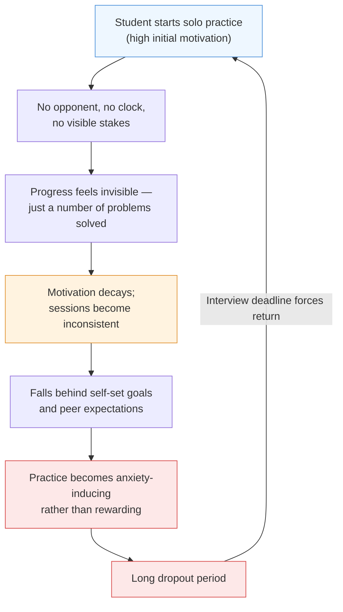

### 2.3 Why existing platforms don't fix this

It is tempting to assume LeetCode or HackerRank could simply "add multiplayer." Two structural reasons suggest they won't, which is precisely Coding Arena's opening:

- **Business model inertia.** LeetCode and HackerRank's revenue depends on structured, asynchronous content (company-tagged question banks, certifications, enterprise assessments). A live-battle mode is a UX and infrastructure rebuild, not a feature toggle, and it doesn't obviously serve their highest-revenue customer (enterprise recruiters), so it is perpetually deprioritized.
- **Judging infrastructure was never built for synchrony.** Asynchronous judges can queue submissions and return results in seconds without anyone noticing. A real-time battle needs sub-second, fair, simultaneously-visible judging for every participant — a genuinely different systems problem (detailed in [Section 11](#11-system-architecture)), which is why no incumbent has quietly shipped this as a side feature.

*A note on tone: this section is written the way it will be read by a skeptical investor. Section 29 returns to these same problems and stress-tests whether "no incumbent has done this" means "there's an opening" or "there's a reason."*

---

## 3. The Solution

Coding Arena's core hypothesis: **the missing ingredient in coding education is not more content — it's an opponent.** Every design decision in this document flows from making synchronous, visible, stakes-bearing competition the default way people practice, not an occasional event.

### 3.1 Problem → Solution Map

| Problem (Section 2) | Coding Arena's Answer |
|---|---|
| Solo grind fatigue | Every practice session can be a live 1v1 or team battle against a matched opponent — practice *is* competition, not a chore adjacent to it. |
| No real-time stakes | Matchmaking runs continuously (not just weekly contests), so a real-time ranked battle is available on demand, any time, the way a ranked match is in any competitive game. |
| Practice ≠ interview reality | Battles are watched (by your opponent, optionally by spectators), timed, and scored live — the closest a practice product can get to interview-realistic pressure, deliberately. |
| Flat gamification | XP, coins, and rank are earned through *wins*, not just volume — mirroring chess Elo, League of Legends rank, and Duolingo leagues, all proven retention mechanics. |
| Fragmented identity | A single Coding Arena Rating becomes a portable, defensible credential — shareable on LinkedIn/resumes the way a Codeforces color-rank already is in some hiring circles, but designed from day one to be legible to non-competitive-programmers too. |
| Weak college/peer layer | Native College Battles, Company Battles, and Club infrastructure make campus rivalry and workplace bragging rights first-class features, not community hacks. |
| Monetization mismatch | Because competition — not just study — is the product, willingness-to-pay expands to include the reasons people pay for competitive games: cosmetics, rank protection, battle passes, spectating, and event tickets, alongside the traditional recruiting/certification revenue the category already knows works. |

### 3.2 Core Concept Recap

**Battle formats:**

| Format | Description | Primary Use Case |
|---|---|---|
| 1v1 | Two players, one problem, live head-to-head | Core ranked ladder, the "quick match" of the platform |
| 2v2 | Two teams of two, shared or split problems | Social/friend-group play, team-skill signaling |
| 1v2 | One player vs. a two-person team | Handicap/asymmetric mode for skill-gap matchmaking |
| Team Battles | Larger teams (3–5), multi-problem relay or parallel format | Club and company internal competitions |
| College Battles | Institution vs. institution, aggregate scoring | Campus pride, ambassador-led acquisition channel |
| Company Battles | Employer-branded battles, often recruiting-linked | B2B revenue + top-of-funnel hiring signal |
| Tournament Mode | Bracketed, multi-round elimination or Swiss-format events | Marquee live events, sponsorships, seasonal prestige |

**Scoring model** (in priority order, each a genuine tie-breaker on the one before it):

1. **Correctness** — passes all hidden test cases (binary gate; incorrect submissions cannot win on any other axis)
2. **Runtime** — execution time relative to the problem's reference solution and other live competitors
3. **Memory usage** — peak memory relative to reference/competitors
4. **Algorithmic quality** — complexity class detected via static/dynamic analysis (e.g., O(n log n) beats a correct-but-brute-force O(n²)) — detailed in [Section 15](#15-ai-integration)
5. **Time complexity** — theoretical complexity class as a distinct, explicit signal from measured runtime (a solution can be measured-fast on small hidden tests but theoretically worse; both are shown)
6. **Submission time** — used strictly as the final tie-breaker, deliberately last, so Coding Arena does not become "who can paste the fastest" the way some rushed contest formats do

**Progression layer:** XP, Coins, Rank (tiered, e.g., Bronze → Silver → Gold → Platinum → Diamond → Grandmaster, with an ELO-style hidden rating underneath visible tiers), Leaderboards (global, college, company, friends), Achievements, Rewards, and Tournament Titles — expanded fully in [Section 17](#17-gamification).

---

## 4. Market Research

*Methodology note: There is no single "real-time competitive coding platform" market report to cite, because the category does not formally exist yet as an analyst-tracked segment — that absence is itself part of the thesis. The estimates below are built two ways for triangulation: **top-down** (summing adjacent, analyst-tracked segments this product overlaps) and **bottom-up** (developer population × realistic engagement and spend assumptions, benchmarked against disclosed economics of comparable freemium competitive platforms — chiefly Chess.com). Every figure here should be read as a directionally-reasoned estimate, not a certified market report. Sourcing is in [Appendix B](#appendix-b-references); assumptions are isolated in [Appendix A](#appendix-a-assumptions) so they can be challenged and updated.*

### 4.1 Adjacent markets (top-down inputs)

| Segment | 2026 Size | Forecast | CAGR | Relevance to Coding Arena |
|---|---|---|---|---|
| Technical interview / mock-interview platforms | ~$0.45B–$1.4B (2024–25 baseline across sources)[5] | $1.2B–$3.5B by 2033 | ~12.5–13.5% | Closest direct comparable — same buyer, same job-to-be-done (interview readiness) |
| Broader "interview preparation tools" market | ~$2.0B–$2.5B (2025)[6] | ~$6.3B by 2031 | ~11.8–15% | Includes resume, behavioral-interview, and coding prep bundled — Coding Arena's realistic wedge is the coding subset |
| Coding bootcamp market | $728M (2026)[7] | $1.88B by 2033 | 14.5% | Adjacent skill-acquisition spend; a channel for partnerships, not a direct competitor |
| Programming software / developer tools (narrow) | ~$2.7B (2026)[8] | $4.38B by 2030 | ~13–15% | Signals broader developer-tooling spend appetite, incl. enterprise budgets Coding Arena's B2B side can tap |
| Global EdTech (broad umbrella) | ~$200B–$240B (2026, varies by analyst)[9] | $450B–$900B+ by 2030–2034 | ~14–18% | The category Coding Arena is classified under for fundraising and comparables purposes |
| India EdTech | ~$7.5B (current)[10] | ~$29–30B by 2030 | ~28–31% (post-correction) | Primary go-to-market geography; note the 2020–2023 boom-bust cycle (BYJU'S) — treated as a risk factor in [Section 21](#21-risk-analysis), not ignored |

### 4.2 TAM, SAM, and SOM

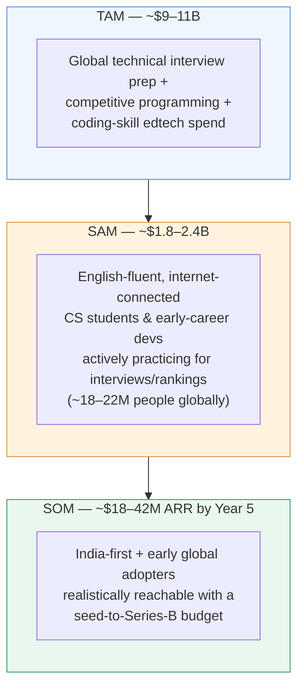

**How each number is built:**

- **TAM (~$9–11B):** Sum of the technical-interview-prep market, the consumer-facing slice of competitive programming / developer-assessment spend, and a conservative slice of coding-specific bootcamp/skill spend — i.e., every dollar currently spent (by individuals or employers) on *proving or improving* algorithmic coding skill, globally.
- **SAM (~$1.8–2.4B):** Bottom-up from population: an estimated 18–22M globally active "interview-prep or competitive-programming engaged" developers (derived from the overlapping-but-deduplicated user bases of LeetCode ~15M+, HackerRank's 26M-developer community, CodeChef, Codeforces, TopCoder, and AtCoder[11]), multiplied by a realistic blended annual spend per engaged user of ~$100–130 — benchmarked *down* from Chess.com's ecosystem economics (~$150M revenue against tens of millions of engaged players[1]) and *up* from LeetCode's implied ARPU (~$100M+ estimated revenue against an estimated 15M+ users[12]), since coding carries higher career stakes than chess but a smaller total audience.
- **SOM (~$18–42M ARR by Year 5):** Built bottom-up from the Year 1–5 user and conversion assumptions in [Section 19](#19-financial-model) — i.e., not asserted top-down, but derived from the same funnel math investors will stress-test.

### 4.3 India Opportunity

India is the deliberate Phase 1 market, for reasons that are more structural than sentimental:

- **Scale of supply:** India has one of the world's largest developer populations (multiple methodologies put it in the 3.8–5.8M range and growing[13]) and is graduating computer-science students at a pace that consistently outstrips immediate job-market absorption — creating a large, motivated, price-sensitive practice-and-prove audience.
- **Cultural fit for competition-as-education:** India already has the world's most intense exam-competition culture (JEE, NEET, UPSC) — the *format* of Coding Arena (ranked, comparative, high-stakes) maps onto existing behavior patterns rather than requiring new ones, unlike in markets where self-paced learning is the norm.
- **Price-sensitive but volume-rich:** The India EdTech correction (from a hyped ~$22B narrative to a grounded ~$2–3B D2C reality[14]) is a caution, not a disqualifier — it specifically punished aggressive, low-retention K-12 tutoring sales tactics, not skill-verification products with genuine utility (test-prep-adjacent categories are explicitly called out as still-resilient segments[10]).
- **Government tailwinds:** Continued public investment in AI-in-education initiatives and digital-skilling policy (e.g., AI Centres of Excellence funding in recent Union Budgets[15]) creates potential institutional/B2G partnership surface area for the college and offline-club expansion in Sections 10 and 18.

### 4.4 Global Opportunity

Beyond India, the rollout logic follows developer density and English-language interview-prep demand: Southeast Asia and the Philippines (large outsourced-development talent pools with strong upward mobility incentive to prep), then the US/Canada/UK/Australia English-speaking markets where LeetCode-style prep is already a normalized cultural behavior (and where willingness-to-pay is highest, evidenced by LeetCode Premium's $19.99–35/month pricing sustaining a large paid base[16]).

### 4.5 Growth Trends Shaping the Category

| Trend | Evidence | Implication for Coding Arena |
|---|---|---|
| AI commoditizing static problem-solving | 84%+ of developers now use AI coding tools regularly[17] | Live, un-aided, adversarial performance becomes a *more* valuable and differentiated signal, not a less relevant one — reframes the product's relevance rather than threatening it (see [Section 21](#21-risk-analysis) for the counter-risk) |
| Gamified, social learning outperforms static content | Duolingo's league/streak mechanics, Kahoot's live-quiz format, and Chess.com's rating ladder are the fastest-growing consumer-education products of the last decade | Validates the specific mechanic (live competition + visible rank) Coding Arena is built around, rather than a generic "add badges" gamification approach |
| Skills-based hiring is displacing resume/pedigree screening | 76%+ of surveyed employers already use skills-based hiring tools[18] | Expands the B2B recruiting-battle and company-challenge revenue lines beyond a novelty — it's aligned with where enterprise hiring budgets are already moving |
| EdTech is bifurcating into "hype" and "outcomes" | India's post-BYJU'S "FOMO to FOGS" (fear of missing out → fear of getting scammed) shift[14] | Coding Arena must lead with demonstrable outcome/skill signal (rating, placement stories), not aggressive sales tactics, to earn trust in a chastened market |
| AI-native interview formats are emerging | Platforms are piloting AI-avatar interviewers and AI-generated adaptive mock interviews[19] | Long-term feature surface (AI Coach, [Section 15](#15-ai-integration)), and a hedge if live-human-adjacent formats become the hiring norm |

### 4.6 Future Demand Signal

The clearest forward indicator is not a market report — it's the shape of the incumbents. Codeforces (free, community-run, nonprofit-adjacent) has the strongest competitive-programming brand and worst monetization. CodeChef, after being acquired and then de-acquired by Unacademy, generates single-digit-millions in revenue on a multi-million user base[2]. TopCoder, the category's oldest player, has visibly hollowed out — practitioners describe Division 1 rounds that once drew hundreds now drawing fewer than 100 competitors[3]. Read together, this is a market with durable *demand* (people keep showing up to compete) and a persistent *monetization and format gap* that no incumbent has solved — which is either a generational opening or a graveyard, and Section 29 does not flinch from that ambiguity.

---

## 5. Competitor Analysis

### 5.1 At-a-Glance Comparison

| Platform | Founded | Est. Users | Primary Model | Revenue Model | Real-Time PvP? |
|---|---|---|---|---|---|
| **LeetCode** | 2015 | ~15M+ registered[12] | Interview prep, company-tagged questions | Freemium subscription (~$20–35/mo) + enterprise assessments[16] | No (weekly async contests only) |
| **Codeforces** | 2010 | 600K–1.9M+[20] | Pure competitive programming | Free / community-run, no real ad or subscription layer | Partial (scheduled rounds, not on-demand) |
| **CodeChef** | 2009 | 2M+[21] | Competitive programming + learning tracks | Courses, sponsored contests; ~$3.8M revenue (FY25)[2] | Partial (scheduled contests) |
| **HackerRank** | 2009 (2012 platform pivot) | 26M-developer community[22] | B2B technical hiring & assessment | Enterprise SaaS (from $165/mo), certifications | No |
| **HackerEarth** | 2012 | Millions (Bengaluru-based)[23] | Hackathons + hiring assessments | Enterprise SaaS (from $99/mo), hackathon sponsorships | Partial (hackathon format) |
| **AtCoder** | 2012 | Large international base | Competitive programming (Japan-origin) | Minimal / sponsor-supported | Partial (scheduled contests) |
| **TopCoder** | 2001 | ~1.5M registered, declining active base[3],[24] | Competitive programming + crowdsourced dev work | Enterprise crowdsourcing contracts | Partial (SRMs, shrinking participation) |
| **InterviewBit** | 2015 | Merged into Scaler ecosystem[25] | Interview prep → paid bootcamp funnel | Freemium → paid Scaler courses | No |

### 5.2 Platform-by-Platform Breakdown

**LeetCode** — *The category leader for interview prep.*
- **Strengths:** Dominant brand recognition among job-seekers; deep company-tagged question library (2,300+ problems); strong SEO and community discussion layer; expanding into AI-assisted "coding agent" tooling.
- **Weaknesses:** Entirely solo/asynchronous; premium is expensive relative to a student budget ($19.99–35/month); no team, club, or campus layer; contests are weekly, scheduled, and impersonal (global leaderboard, not a matched opponent).
- **Revenue model:** B2C subscription (majority) + growing B2B "LeetCode for Teams" and sponsored-contest recruiting revenue[12].
- **Missing features:** Any form of on-demand, matched, live opponent play; native college/company identity; offline presence.
- **Opportunity for Coding Arena:** Position directly against the "grinding alone is demoralizing" pain point LeetCode cannot solve without rebuilding its core product around synchrony.

**Codeforces** — *The competitive programmer's platform of record.*
- **Strengths:** Immense credibility within serious competitive programming; frequent, well-designed contests; a rating system competitive programmers genuinely care about defending.
- **Weaknesses:** Intimidating for newcomers (steep difficulty curve, sparse UX); essentially unmonetized; no beginner on-ramp, no casual/social layer, no live head-to-head format outside scheduled rounds.
- **Revenue model:** Effectively none — sustained as a community/passion project.
- **Missing features:** Any commercial layer at all; approachable onboarding; real-time matched play.
- **Opportunity for Coding Arena:** Codeforces proves the *demand* for a defensible rating system is real and durable — Coding Arena can be "Codeforces's rating obsession, with Chess.com's onboarding and business model."

**CodeChef** — *India's competitive programming platform, now independent again.*
- **Strengths:** Strong India brand recall; long history running ICPC/IOI regional rounds; large user base.
- **Weaknesses:** Revenue (~$3.8M[2]) is tiny relative to its 2M+ user base, evidencing a monetization ceiling on the "pure competitive programming" model; went through an acquisition and de-acquisition cycle (Unacademy, 2020–2023) signaling strategic uncertainty.
- **Revenue model:** Courses, sponsored contests, minor enterprise engagement.
- **Missing features:** Real-time 1v1/team play; modern UX; a clear identity distinct from "CodeChef but smaller" relative to Codeforces.
- **Opportunity for Coding Arena:** Directly demonstrates the ceiling of the current business model in Coding Arena's own home market — the opportunity is proving a *different* model (competitive gaming layer, not course sales) works better.

**HackerRank** — *The enterprise hiring incumbent.*
- **Strengths:** Massive enterprise footprint (2,500+ customers, 25%+ of the Fortune 100[22]); trusted brand among recruiters; broad language/role coverage; investing seriously in AI-assessment tooling.
- **Weaknesses:** Product is built for *employers*, not for developer delight — widely cited UX complaints, "brand fatigue" among candidates who've seen the same test format repeatedly[26]; no consumer competitive/social layer at all.
- **Revenue model:** Enterprise SaaS + certifications.
- **Missing features:** Any consumer-facing reason to *want* to be on the platform outside of a mandated assessment.
- **Opportunity for Coding Arena:** HackerRank owns the "employer trusts this brand" position — Coding Arena's Company Battles and recruitment features can be the *candidate-loved* complement, and a natural HackerRank-displacement pitch to employers who want better candidate experience.

**HackerEarth** — *The hackathon-and-hiring specialist.*
- **Strengths:** Genuine differentiation via hackathon hosting (a format closer to Coding Arena's "event" DNA than pure assessment); Bengaluru roots give it India credibility; newer AI interview-agent features (OnScreen) show product ambition[27].
- **Weaknesses:** Still fundamentally a B2B assessment tool wearing a hackathon costume; pricing and product clarity criticized in reviews; no real-time 1v1 ladder.
- **Revenue model:** Enterprise SaaS (from $99/month) + hackathon sponsorships.
- **Missing features:** Individual competitive ranking ladder; social/friend layer; offline club infrastructure.
- **Opportunity for Coding Arena:** HackerEarth's hackathon-sponsorship revenue line validates that companies will pay to run branded competitive coding events — directly transferable to Coding Arena's Company Battles line.

**AtCoder** — *The quality benchmark.*
- **Strengths:** Widely regarded as having the best-written, most elegant problem sets in competitive programming; strong, loyal international following; efficient, well-run contest cadence.
- **Weaknesses:** Minimal monetization; contest-only cadence (no on-demand play); UX and features have changed little in years.
- **Revenue model:** Largely sponsor/community-supported.
- **Missing features:** Any real-time matched play, any commercial ambition.
- **Opportunity for Coding Arena:** Sets the quality bar Coding Arena's problem-setting team must clear to earn credibility with serious competitive programmers — a reputational, not competitive-overlap, opportunity.

**TopCoder** — *The cautionary tale.*
- **Strengths:** Deep history and brand recognition among veteran competitive programmers; established crowdsourced-development business line separate from contests.
- **Weaknesses:** Visibly declining contest participation — practitioners on Codeforces openly discuss Division 1 Single Round Matches that once drew hundreds now drawing under 100 competitors[3]; dated UX frequently cited as a reason newer competitive programmers never adopted it[28].
- **Revenue model:** Enterprise crowdsourcing contracts (separate from the contest platform itself).
- **Missing features:** Everything modern competitive/social platforms now expect — this is the clearest evidence in the entire competitive set that a stagnant format loses even a loyal niche audience over time.
- **Opportunity for Coding Arena:** A direct lesson, not just an opportunity — TopCoder shows what happens to a competitive coding platform that does not keep reinvesting in format and UX. Section 29 treats this as a genuine risk to Coding Arena's own long-term position, not just a competitor's failure.

**InterviewBit** — *Now folded into the Scaler funnel.*
- **Strengths:** Strong, structured interview-prep curriculum; founding team has deep competitive programming credibility (ICPC World Finalists)[29].
- **Weaknesses:** Product is now primarily a top-of-funnel lead-gen tool for Scaler's paid bootcamp, not a standalone destination; no live competitive format.
- **Revenue model:** Freemium content funneling into Scaler Academy's paid, multi-thousand-dollar bootcamp programs.
- **Missing features:** Any independent competitive or social layer.
- **Opportunity for Coding Arena:** Demonstrates the "prep → paid upsell" funnel works commercially in this exact user base, validating one path in Coding Arena's own business model ([Section 7](#7-business-model)).

### 5.3 Competitive Positioning Map

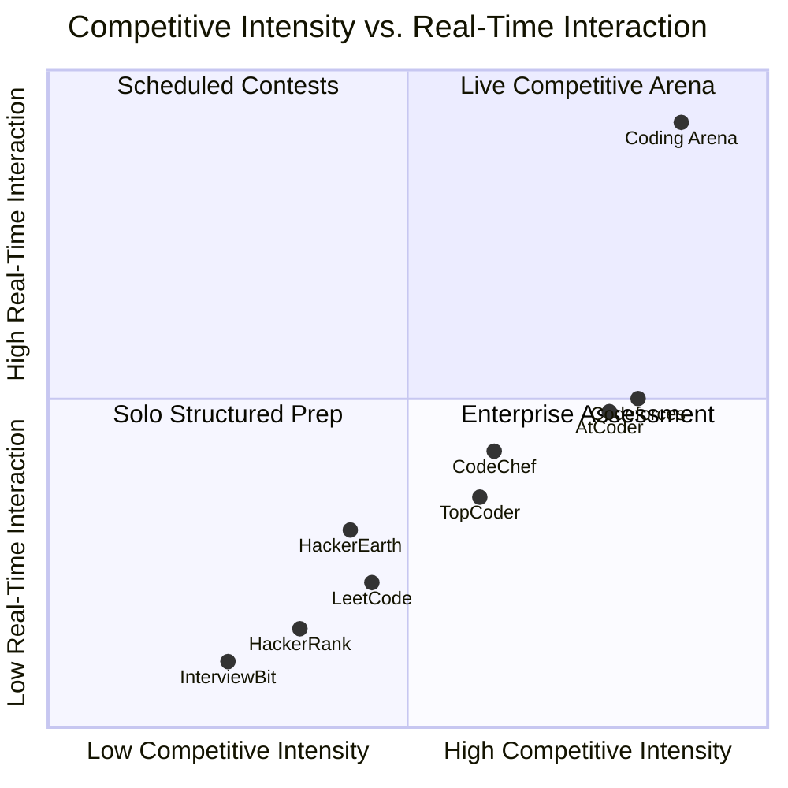

*Reading the map: every incumbent clusters below ~0.5 on real-time interaction, no matter how competitive their format is. That empty top-right quadrant — high competitive intensity, high real-time interaction, on demand rather than scheduled — is Coding Arena's entire positioning thesis in one chart.*

---

## 6. Unique Selling Proposition

**Coding Arena is the only platform where practicing to code and competing to win are the same action, on demand, against a real matched opponent.**

| Differentiator | Why It's Defensible |
|---|---|
| **On-demand real-time matchmaking**, not scheduled contests | Requires purpose-built low-latency judging infrastructure ([Section 11](#11-system-architecture)) that asynchronous-first incumbents would need to substantially rebuild, not bolt on |
| **A single, portable competitive rating** built for legibility beyond hardcore competitive programmers | Codeforces has the rating culture but not the onboarding; LeetCode has the onboarding but not the rating culture; Coding Arena is designed to have both from day one |
| **Native team, college, and company identity** | No incumbent treats "which college/company you represent" as a first-class object — Coding Arena's data model does ([Section 12](#12-database-design)) |
| **Multi-axis live scoring** (correctness → runtime → memory → algorithmic quality → complexity → submission time) | Most contest platforms score on correctness + time only; Coding Arena's scoring is closer to how a real interview is actually judged, which strengthens the "practice equals reality" pitch |
| **A monetization model borrowed from competitive gaming, not just edtech** | Cosmetics, battle passes, and rank-protection mechanics (proven at massive scale in gaming) are largely untapped in this category — see [Section 7](#7-business-model) |
| **An explicit offline roadmap** (clubs, campus leagues, a World Cup) | No competitor has any offline strategy at all — this is the single clearest structural parallel to Chess.com's and traditional esports' long-run playbook |

---

## 7. Business Model

Coding Arena is designed as a **multi-line revenue business from day one**, deliberately avoiding the single-point-of-failure exposure of "subscription only" (LeetCode's core risk) or "enterprise only" (HackerRank's core risk).

### 7.1 Revenue Streams

| Stream | Description | Payer | Maturity Stage |
|---|---|---|---|
| **Premium Membership** | Ranked-mode priority matchmaking, advanced analytics, exclusive problem sets, ad-free, cosmetic unlocks | Consumer (B2C) | Launch |
| **Battle Pass / Seasonal Pass** | Time-boxed reward track tied to seasonal ranked ladder — gaming-industry-proven mechanic | Consumer (B2C) | Year 1–2 |
| **Recruitment** | Employers access a searchable, rating-verified candidate pool and can invite top performers directly | B2B (Employers) | Year 1–2 |
| **Sponsored Contests** | Branded tournaments run on the platform (the HackerEarth-proven hackathon-sponsorship model, adapted to live-battle format) | B2B (Sponsors/Employers) | Year 1 |
| **College Partnerships** | Paid institutional dashboards for placement cells to track and train student cohorts | B2B2C (Institutions) | Year 2 |
| **Offline Clubs** | Membership fees, venue partnerships, local event tickets | Consumer + B2B2C | Year 3+ |
| **Hackathons** | Platform-hosted, sponsor-funded hackathon events (hybrid online/offline) | B2B (Sponsors) | Year 2 |
| **Merchandise** | Rank-themed apparel and accessories (mirrors Chess.com's and esports orgs' merch lines) | Consumer (B2C) | Year 2–3 |
| **Certification** | Verified skill certificates tied to Coding Arena Rating, recognized by partner employers | Consumer + B2B (co-funded) | Year 2 |
| **Subscriptions (Team/Club tier)** | Bulk seats for college clubs or company internal engineering teams | B2B2C | Year 2 |
| **Tournament Tickets** | Paid entry for high-stakes tournaments with real prize pools | Consumer (B2C) | Year 2–3 |
| **Brand Collaborations** | Cross-promotions with developer tool brands, tech publications, gaming peripherals | B2B (Brand partners) | Year 3+ |
| **API Access** | Judge/matchmaking infrastructure licensed to third parties (colleges, other edtech products) | B2B (Platform) | Year 3+ |

### 7.2 Projected Revenue Mix (Illustrative, Year 3)

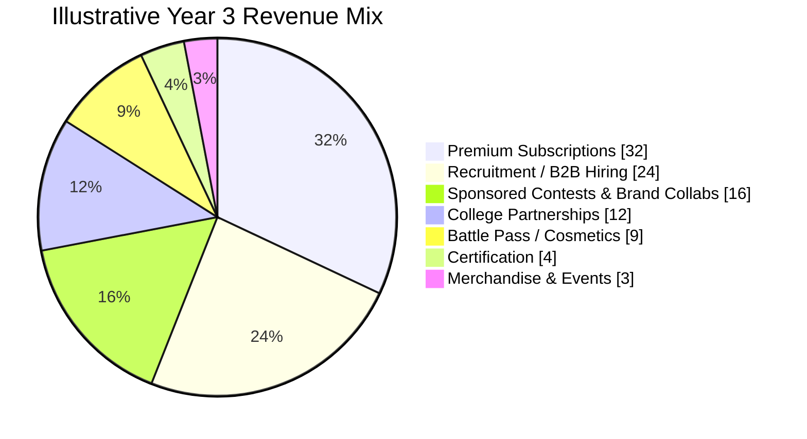

*This mix is deliberately more B2B-weighted than a pure consumer-gaming company and more consumer-weighted than a pure HackerRank-style enterprise product — it is the specific hybrid the competitive analysis in Section 5 suggests is open.*

### 7.3 Illustrative Unit Economics (Year 2 target, B2C)

| Metric | Illustrative Target | Benchmark Used |
|---|---|---|
| Free-to-paid conversion | 3–5% | LeetCode's estimated B2C conversion range[12] |
| Blended ARPU (paying users) | $60–90/year | Below LeetCode's $159–240/year premium pricing to reflect a younger, more price-sensitive India-first cohort |
| Target CAC (organic-heavy channel mix) | <$3–5 per registered user | Campus-ambassador and referral-led acquisition (see [Section 20](#20-marketing-strategy)) keeps this far below paid-social norms |
| Target LTV:CAC | >3:1 by Year 2 | Standard early-stage SaaS/consumer health bar |

*These are planning targets for the model in [Section 19](#19-financial-model), not achieved metrics — the company has no traction data yet at the pre-seed stage.*

---

## 8. Product Roadmap

### 8.1 Milestone Table

| Horizon | Core Milestones |
|---|---|
| **Year 1** | Ship MVP (1v1 real-time battles, core judge, basic ranking); onboard first 3–5 partner colleges; reach ~25K–75K registered users; run first sponsored company battle; validate retention lift of competitive vs. solo mode |
| **Year 2** | Launch Team Battles, College Battles, and Tournament Mode; introduce Premium tier and Battle Pass; scale to ~300K–600K users across India; first paid B2B recruitment contracts; begin AI Coach beta |
| **Year 3** | Company Battles at scale; College Partnership dashboards; certification product; first international market (Southeast Asia) launch; approach ~1.5–3M users; evaluate Series A/B readiness |
| **Year 5** | Offline Coding Arena Clubs live in 10–15 Indian cities; first national league season; international expansion to English-speaking markets; API/platform licensing line live; target ~8–15M users |
| **Year 10** | "Chess.com of Coding" positioning realized: global online platform + multi-country offline club network; annual Coding Arena World Cup with broadcast/sponsorship revenue; recognized hiring-signal status among major employers; category-defining brand |

### 8.2 Roadmap Timeline

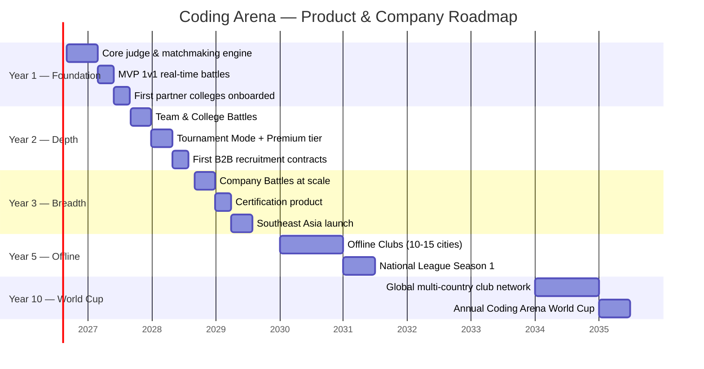

*Dates are planning placeholders anchored to an assumed fundraising and build start in Q3 2026; every downstream date should shift with actual fundraising close.*

---

## 9. Feature Breakdown

### 9.1 Full Feature Matrix

| Category | Feature | Description | Priority |
|---|---|---|---|
| **Core Platform** | Authentication | Email, OAuth (Google/GitHub), college-email verification for campus battles | P0 (MVP) |
| | Profiles | Rating, battle history, badges, achievements, GitHub/LinkedIn linking | P0 |
| | Code Editor | Multi-language, syntax highlighting, autocomplete, split-screen opponent view | P0 |
| | Compiler | Sandboxed multi-language execution (C++, Java, Python, JS, Go, etc.) | P0 |
| | Judge | Real-time correctness, runtime, and memory evaluation against hidden test cases | P0 |
| **Competitive Systems** | Matchmaking | Skill-based (hidden-rating) real-time pairing across all battle formats | P0 |
| | Ranking | Elo-style hidden rating driving visible tiers (Bronze → Grandmaster) | P0 |
| | Leaderboard | Global, college, company, and friends-only views | P0 |
| | Tournament System | Bracketed/Swiss formats, scheduling, seeding, live brackets | P1 |
| | Battle History | Full record of past battles with problem, result, and opponent | P0 |
| | Replay System | Move-by-move (keystroke-level) playback of past battles for review/learning | P1 |
| **Social & Community** | Friends | Add/challenge friends directly, friends-only leaderboard | P1 |
| | Teams | Persistent team formation for Team Battles and club representation | P1 |
| | Communities | College/company/interest-based groups, discussion threads | P2 |
| | Chat | In-battle and post-battle messaging, moderated | P1 |
| | Notifications | Match found, tournament starting, rank change, friend activity | P0 |
| **Progression & Economy** | Achievements | Milestone-based badges (first win, win streak, perfect score, etc.) | P1 |
| | Rewards | XP, coins, seasonal items tied to performance | P0 |
| | Wallet | In-app currency balance, transaction history, purchase management | P1 |
| **Intelligence Layer** | AI Coach | Personalized weak-topic detection and problem recommendations ([Section 15](#15-ai-integration)) | P2 |
| | Interview Mode | Simulated live interview format with AI or human interviewer option | P2 |
| | Company Challenges | Employer-branded battle sets, often tied to real hiring pipelines | P1 |
| **Admin & Operations** | Admin Panel | Problem set management, contest scheduling, user moderation | P0 |
| | Analytics | Platform-wide and per-user engagement, retention, and battle analytics | P0 |
| | Offline Club Management | Chapter registration, local event scheduling, ambassador tools ([Section 18](#18-offline-expansion-coding-arena-clubs)) | P3 |

*Priority key: P0 = required for MVP; P1 = required within Year 1; P2 = Year 2 target; P3 = Year 3+ (offline expansion horizon).*

### 9.2 Feature Map

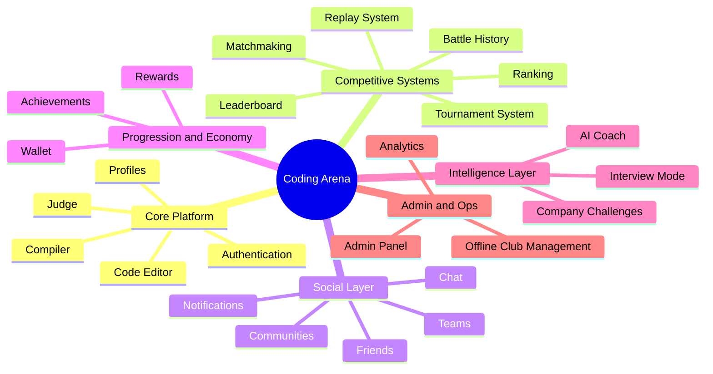

---

## 10. User Flow

### 10.1 Signup Flow

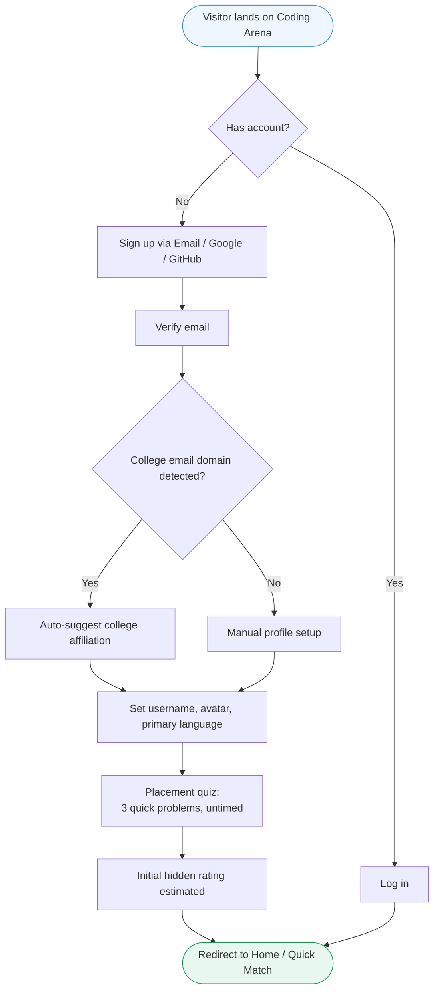

### 10.2 Battle Flow

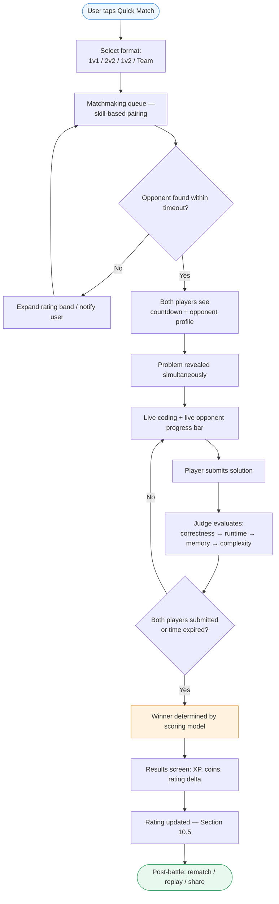

### 10.3 Tournament Flow

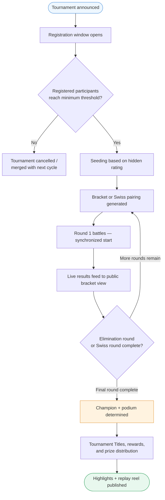

### 10.4 Reward System Flow

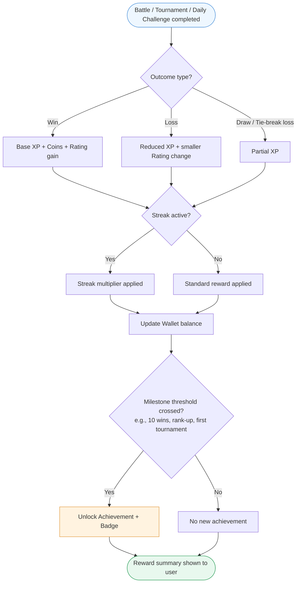

### 10.5 Ranking Update Flow

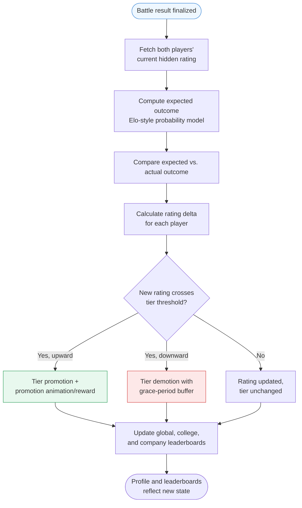

### 10.6 Club Registration Flow

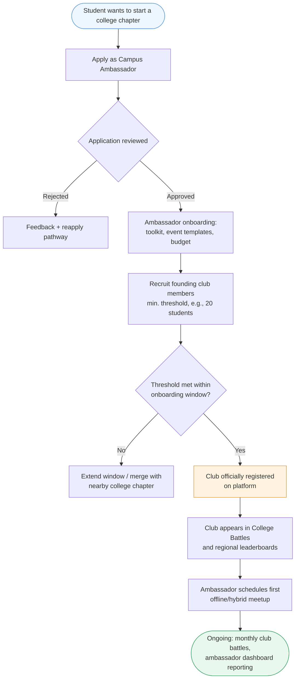

### 10.7 Recruitment Flow

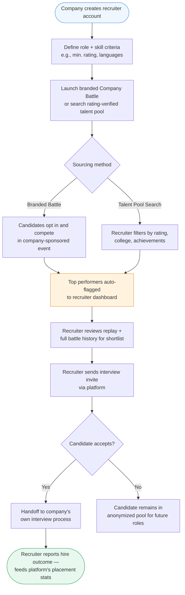

---

## 11. System Architecture

Coding Arena's hardest technical problem — and its core defensibility — is **fair, low-latency, simultaneous judging for every live participant in a battle.** The architecture below is designed around that constraint first; every other service is comparatively standard SaaS infrastructure.

### 11.1 High-Level Architecture Diagram

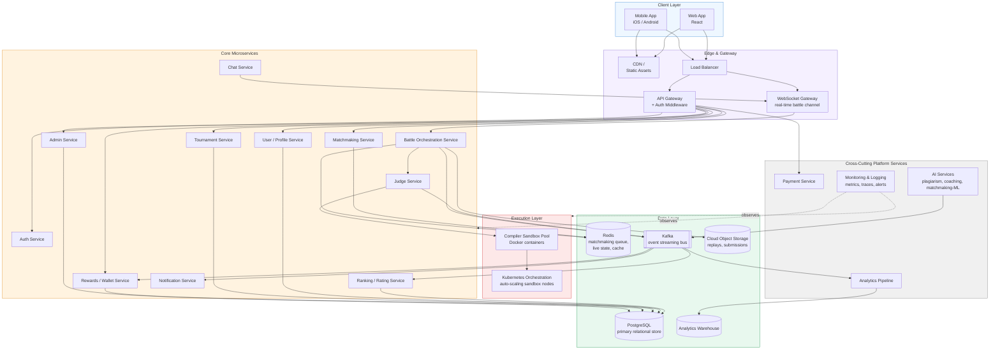

### 11.2 Component Explanations

| Component | Role | Why It's Designed This Way |
|---|---|---|
| **Web / Mobile Clients** | React web app; native iOS/Android for on-the-go matchmaking notifications | Battles are latency-sensitive; native mobile reduces input lag versus a wrapped web view |
| **CDN** | Serves static assets, editor bundles, problem statements | Reduces load time globally, critical for India's mixed-quality mobile networks |
| **API Gateway** | Single entry point for REST calls; handles auth token validation, rate limiting | Centralizes cross-cutting concerns so individual services stay simple |
| **WebSocket Gateway** | Persistent connection layer for live battle state, opponent progress, chat | HTTP polling cannot deliver the sub-second opponent-progress updates the product experience depends on |
| **Matchmaking Service** | Pairs players by hidden rating, format, and latency region | Isolated as its own service because queueing logic and scaling needs differ sharply from CRUD services |
| **Battle Orchestration Service** | Owns the lifecycle of a live battle: start, sync problem reveal, track submissions, declare winner | The "conductor" service coordinating Judge, Ranking, and Reward services for each battle instance |
| **Judge Service** | Dispatches submissions to sandboxed execution, collects correctness/runtime/memory results | Kept separate from Battle Orchestration so judging can scale independently under contest-day load spikes |
| **Compiler Sandbox Pool (Docker + Kubernetes)** | Isolated, resource-capped containers executing untrusted user code per language | Security-critical: every submission is untrusted code and must be fully isolated from the host and from other users' sandboxes |
| **Ranking Service** | Computes Elo-style rating deltas, tier promotions/demotions | Decoupled via Kafka so a ranking-calculation slowdown never blocks battle completion for users |
| **Tournament Service** | Manages bracket/Swiss generation, scheduling, seeding | Bursty by nature (idle most of the time, extremely hot during live events) — benefits from independent auto-scaling |
| **Rewards / Wallet Service** | Tracks XP, coins, purchases, battle pass progress | Financial-adjacent logic isolated for auditability and to simplify future payment-compliance work |
| **Notification Service** | Push/email/in-app alerts for match-found, rank change, tournament start | Fully async consumer of the Kafka event stream — never a synchronous dependency of the battle path |
| **Redis** | Matchmaking queues, live battle state, session cache | In-memory speed is required for matchmaking queue operations and live opponent-progress state |
| **Kafka** | Event backbone connecting Battle/Judge outcomes to Ranking, Rewards, Notifications, Analytics, AI | Decouples "what happened in a battle" from "everything that needs to react to it," which is what lets the platform add new reactive features without touching the battle path |
| **PostgreSQL** | System of record for users, problems, battles, tournaments, teams, colleges/companies | Relational integrity matters for rankings, battle history, and financial records |
| **Cloud Object Storage** | Stores full keystroke-level replays and submission code | Large binary/blob data does not belong in the relational store |
| **Analytics Warehouse** | Aggregated data for KPI dashboards, cohort analysis, AI training data | Separated from the transactional database so heavy analytical queries never degrade live-battle performance |
| **AI Services** | Plagiarism detection, coaching recommendations, matchmaking quality tuning, cheating pattern detection | Detailed in [Section 15](#15-ai-integration); consumes the same Kafka event stream rather than sitting in the critical battle path |
| **Payment Service** | Subscription billing, wallet top-ups, tournament ticketing | Isolated and PCI-scope-minimized by delegating actual card handling to a certified payment processor |
| **Monitoring & Logging** | Metrics, distributed tracing, alerting across all services | Given the latency sensitivity of live battles, this is treated as a first-class system, not an afterthought |

### 11.3 Why Real-Time Judging Is the Hard Part

Asynchronous judges (LeetCode, HackerRank, CodeChef) can tolerate a queue: a submission waits its turn, and a few seconds of delay is invisible to a solo user. Coding Arena cannot: two live opponents must see judging results at effectively the same moment, under fair and consistent conditions, even under contest-day load spikes when thousands of sandboxes spin up simultaneously. This requires pre-warmed sandbox pools, aggressive autoscaling headroom on Kubernetes ahead of scheduled tournaments, and a Judge Service architected for tight P99 latency budgets — not just average-case throughput. This is the single largest engineering investment in the roadmap and the primary reason this category has not already been built by a well-funded incumbent treating it as a "simple feature add."

---

## 12. Database Design

### 12.1 Entity-Relationship Diagram

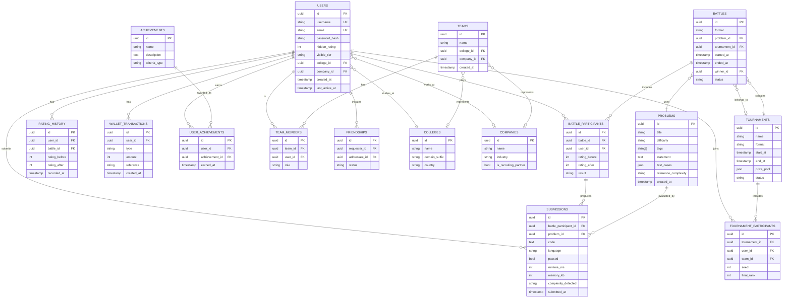

### 12.2 Table Reference

| Table | Purpose | Key Fields | Recommended Indexes |
|---|---|---|---|
| `users` | Core identity, rating, affiliation | `id (PK)`, `username`, `email`, `hidden_rating`, `college_id (FK)`, `company_id (FK)` | Unique on `username`, `email`; B-tree on `hidden_rating` (leaderboard queries); composite on `(college_id, hidden_rating)` |
| `problems` | Problem bank | `id (PK)`, `difficulty`, `tags[]`, `test_cases (JSON)` | GIN index on `tags[]`; B-tree on `difficulty` |
| `battles` | Battle instances | `id (PK)`, `problem_id (FK)`, `tournament_id (FK)`, `status`, `winner_id (FK)` | B-tree on `status` (for active-battle queries); composite on `(tournament_id, status)` |
| `battle_participants` | Join table: users ↔ battles | `battle_id (FK)`, `user_id (FK)`, `result` | Composite unique on `(battle_id, user_id)`; B-tree on `user_id` (battle history lookups) |
| `submissions` | Every code submission with judged results | `battle_participant_id (FK)`, `runtime_ms`, `memory_kb`, `passed` | B-tree on `battle_participant_id`; partial index on `passed = true` |
| `teams` / `team_members` | Team formation and roster | `team_id (FK)`, `user_id (FK)` | Composite unique on `(team_id, user_id)` |
| `tournaments` / `tournament_participants` | Tournament lifecycle and entrants | `tournament_id (FK)`, `seed`, `final_rank` | B-tree on `status`; composite on `(tournament_id, seed)` |
| `colleges` / `companies` | Institutional entities for identity and B2B | `domain_suffix`, `is_recruiting_partner` | Unique on `domain_suffix` |
| `rating_history` | Immutable audit trail of every rating change | `user_id (FK)`, `battle_id (FK)`, `recorded_at` | B-tree on `(user_id, recorded_at)` for rating-over-time charts |
| `wallet_transactions` | Financial/XP/coin ledger | `user_id (FK)`, `type`, `amount` | B-tree on `(user_id, created_at)` |
| `achievements` / `user_achievements` | Achievement definitions and grants | `user_id (FK)`, `achievement_id (FK)` | Composite unique on `(user_id, achievement_id)` |
| `friendships` | Social graph | `requester_id (FK)`, `addressee_id (FK)`, `status` | Composite unique on `(requester_id, addressee_id)` |

*Design notes: `submissions.code` and full battle replays are kept out of PostgreSQL entirely and stored in object storage (referenced by `submission.id`), consistent with the architecture in Section 11 — this keeps the primary transactional database small and fast under battle-day load. `rating_history` is intentionally append-only/immutable, since a defensible competitive rating requires a tamper-evident audit trail.*

---

## 13. API Design

All endpoints are versioned (`/api/v1/...`), authenticated via short-lived JWTs issued by the Auth Service, and rate-limited at the API Gateway. Real-time battle events (opponent progress, judge results) travel over the WebSocket channel, not REST — the tables below cover the REST surface.

### 13.1 Authentication APIs

| Method | Endpoint | Description | Auth Required |
|---|---|---|---|
| POST | `/api/v1/auth/signup` | Create account (email or OAuth) | No |
| POST | `/api/v1/auth/login` | Authenticate, issue JWT + refresh token | No |
| POST | `/api/v1/auth/refresh` | Exchange refresh token for new JWT | Refresh token |
| POST | `/api/v1/auth/logout` | Revoke refresh token | Yes |
| POST | `/api/v1/auth/verify-college-email` | Verify institutional email for college affiliation | Yes |

### 13.2 Battle APIs

| Method | Endpoint | Description | Auth Required |
|---|---|---|---|
| POST | `/api/v1/battles/queue` | Enter matchmaking queue for a given format | Yes |
| DELETE | `/api/v1/battles/queue` | Leave matchmaking queue | Yes |
| GET | `/api/v1/battles/{id}` | Fetch battle state, participants, problem | Yes |
| POST | `/api/v1/battles/{id}/submit` | Submit code for judging | Yes |
| GET | `/api/v1/battles/{id}/replay` | Fetch keystroke-level replay | Yes |
| GET | `/api/v1/users/{id}/battles` | Battle history for a user | Yes |

### 13.3 Tournament APIs

| Method | Endpoint | Description | Auth Required |
|---|---|---|---|
| GET | `/api/v1/tournaments` | List upcoming/active tournaments | No |
| POST | `/api/v1/tournaments/{id}/register` | Register self or team for a tournament | Yes |
| GET | `/api/v1/tournaments/{id}/bracket` | Fetch live bracket/standings | No |
| POST | `/api/v1/tournaments` | Create a tournament (sponsor/admin) | Yes (Admin/Sponsor role) |

### 13.4 Reward APIs

| Method | Endpoint | Description | Auth Required |
|---|---|---|---|
| GET | `/api/v1/users/{id}/wallet` | Fetch coin/XP balance and transaction history | Yes |
| GET | `/api/v1/users/{id}/achievements` | List earned achievements | Yes |
| POST | `/api/v1/wallet/purchase` | Spend coins on cosmetics/battle pass | Yes |
| GET | `/api/v1/leaderboards/{scope}` | Global, college, company, or friends leaderboard | No (public scopes) |

### 13.5 Admin APIs

| Method | Endpoint | Description | Auth Required |
|---|---|---|---|
| POST | `/api/v1/admin/problems` | Create/update problem and test cases | Yes (Admin) |
| POST | `/api/v1/admin/users/{id}/suspend` | Suspend a user (anti-cheat enforcement) | Yes (Admin) |
| GET | `/api/v1/admin/analytics/overview` | Platform-wide KPI snapshot | Yes (Admin) |
| POST | `/api/v1/admin/companies/{id}/verify` | Approve a company as a recruiting partner | Yes (Admin) |

---

## 14. Technology Stack

| Layer | Technology | Why This Choice |
|---|---|---|
| **Frontend (Web)** | React + TypeScript, Monaco Editor (VS Code's editor component) | Monaco is the de facto standard for in-browser code editing (used by LeetCode, CodeSandbox); TypeScript reduces runtime bugs in a UI with complex real-time state |
| **Frontend (Mobile)** | React Native | Single codebase for iOS/Android given a lean early team; native modules used selectively for WebSocket performance-critical paths |
| **Real-Time Layer** | WebSockets (via a managed gateway, e.g., Socket.IO or a raw WS layer behind the API Gateway) | Lowest-latency option for bidirectional live battle state; fallback long-polling for constrained networks |
| **Backend Services** | Node.js (TypeScript) for I/O-bound services (Auth, User, Notification); Go for latency-critical services (Battle Orchestration, Judge dispatch) | Node.js maximizes early team velocity; Go is chosen specifically where P99 latency and concurrency matter most |
| **Compiler Sandbox** | Docker containers, one per submission, strict CPU/memory/time limits, network-disabled | Industry-standard isolation approach for untrusted code execution (same pattern used by every major online judge) |
| **Container Orchestration** | Kubernetes (managed, e.g., EKS/GKE) with horizontal pod autoscaling on the sandbox pool | Enables pre-warming and rapid scale-up ahead of scheduled tournaments, and scale-down during idle hours to control cost |
| **Primary Database** | PostgreSQL (managed, e.g., RDS/Cloud SQL) | Relational integrity for rankings, battle records, and financial data; mature ecosystem, strong JSON support for flexible fields like `test_cases` |
| **Cache / Real-Time State** | Redis (managed, e.g., ElastiCache) | In-memory speed for matchmaking queues and live battle state |
| **Event Streaming** | Apache Kafka (managed, e.g., MSK/Confluent Cloud) | Decouples battle outcomes from downstream consumers (ranking, rewards, notifications, analytics, AI) |
| **Object Storage** | Cloud object storage (S3-compatible) | Cost-effective storage for replays and submitted code blobs |
| **CDN** | CloudFront / Cloudflare | Global static asset delivery, critical for latency-sensitive markets like India's Tier 2/3 cities |
| **Cloud Provider** | AWS (primary), multi-region for India + future international expansion | Broadest managed-service maturity for the Kubernetes/Kafka/Postgres combination at this scale |
| **AI / ML Services** | Managed LLM APIs for coaching/plagiarism-explanation features; custom lightweight models (e.g., gradient-boosted trees) for cheating-pattern and matchmaking-quality scoring | Uses best-in-class LLMs for language-heavy tasks (coaching feedback) while keeping latency-critical, high-volume scoring tasks on cheaper custom models |
| **Payments** | Stripe (global) + Razorpay (India-specific rails, UPI support) | Razorpay is close to mandatory for India-first consumer payments (UPI dominance); Stripe covers international expansion |
| **CI/CD** | GitHub Actions + Argo CD (GitOps for Kubernetes deploys) | Standard, well-documented toolchain that scales from a 5-person team to a 50-person engineering org without a platform rewrite |
| **Testing** | Jest/Vitest (unit), Playwright (E2E), k6 (load testing the matchmaking/judge path specifically) | Load testing is treated as a first-class discipline given the tournament-day spike profile |
| **Monitoring & Observability** | Prometheus + Grafana (metrics), OpenTelemetry (tracing), Sentry (error tracking) | Open, portable stack that avoids vendor lock-in while giving the latency visibility real-time battles require |
| **Logging** | ELK stack (Elasticsearch, Logstash, Kibana) or a managed equivalent | Centralized log search essential for debugging live-battle incidents and anti-cheat investigation |

---

## 15. AI Integration

AI is used throughout Coding Arena as an **augmentation layer on top of the core competitive product**, not as the product itself — a deliberate choice given how fast "AI-wrapper" positioning commoditizes (see [Section 21](#21-risk-analysis)).

| Use Case | How It Works | Product Surface |
|---|---|---|
| **Solution review** | LLM-based static analysis of submitted code explains *why* a solution is efficient or inefficient, in natural language, after a battle ends | Post-battle results screen |
| **Plagiarism detection** | Combination of AST-level (abstract syntax tree) structural comparison across submissions and embedding-based similarity search, flagged for human review above a confidence threshold | Anti-Cheat pipeline ([Section 16](#16-anti-cheat-system)) |
| **Problem recommendation** | Collaborative filtering + topic-weakness modeling recommends the next problem/battle type likely to close a specific skill gap | AI Coach |
| **Personalized coaching** | LLM-generated, rating-aware explanations pitched at the user's demonstrated skill level rather than generic editorial content | AI Coach |
| **Interview preparation** | Simulated live interview mode where an AI interviewer asks clarifying questions and evaluates communication, not just correctness | Interview Mode |
| **Matchmaking quality** | A lightweight ML model continuously tunes matchmaking beyond raw rating (accounting for language preference, latency region, recent win-streak "hot hand" effects) to improve perceived match fairness | Matchmaking Service |
| **Skill assessment** | Aggregate submission patterns (not just win/loss) build a multi-dimensional skill profile (e.g., strong on graphs, weak on DP) shown to the user and, if they opt in, to recruiters | Profile, Company Challenges |
| **Cheating prediction** | Behavioral anomaly detection (typing cadence shifts, paste-heavy submissions, statistically improbable solve times) surfaces a *risk score* per submission for human moderators — the AI flags, it does not auto-convict | Anti-Cheat pipeline |

*Design principle: every AI feature listed above is either (a) informational/coaching, where a wrong AI output degrades UX but not fairness, or (b) a flag-for-human-review signal in the anti-cheat pipeline, never a fully automated ban decision. This is a deliberate trust and fairness choice, expanded in Section 16.*

---

## 16. Anti-Cheat System

Contest integrity is existential for a platform whose entire value proposition is a *trustworthy* competitive rating — if the rating can be gamed, the product's core asset is worthless. Anti-cheat is treated as a first-class system, not a moderation afterthought.

| Threat | Detection Method | Response |
|---|---|---|
| **Copy-pasting a solution found externally** | Code-similarity analysis (AST comparison + embedding similarity) against a corpus of known public solutions and other users' submissions | Flag for review; confirmed cases receive rating rollback + escalating suspension |
| **Multiple accounts (smurfing / ban evasion)** | Device fingerprinting, behavioral pattern matching across accounts, IP/network clustering | Account linking flagged; repeat offenders' accounts merged or banned in cluster |
| **VPN / region abuse** (e.g., faking college affiliation, exploiting regional leaderboards) | IP geolocation cross-checked against declared college/company affiliation and verified email domain | College/company battle eligibility revoked for mismatches; does not block normal play |
| **AI-generated code submitted as one's own** | Behavioral signals (paste-heavy input pattern, unnaturally uniform typing cadence, solve-time statistically inconsistent with the user's own history) combined with stylistic-consistency modeling against the user's prior submissions | Flagged for human review; Interview Mode and rated battles can require a "live coding" mode with stricter behavioral monitoring |
| **Browser-level cheating** (opening a second tab, dev-tools tampering) | Browser focus/visibility-change monitoring, opt-in webcam/screen proctoring for high-stakes tournaments only | Warning on first detection in casual play; disqualification in monitored tournament formats |
| **Collusion between opponents** (agreeing to intentionally lose/win) | Statistical anomaly detection on rating-manipulation patterns (e.g., repeated pairings with suspiciously consistent outcomes) | Flag for review; confirmed collusion results in rating rollback for both parties |
| **Contest integrity at scale** (tournament-specific exploits, e.g., problem leakage) | Access-logged problem staging environment, delayed public release of problem statements until synchronized start | Immediate tournament-round invalidation and re-run protocol if leakage is confirmed |

**Governing principle:** every automated detection method above produces a *flag with a confidence score*, routed to a human moderation queue — full auto-ban is reserved only for the highest-confidence, lowest-false-positive cases (e.g., byte-for-byte code matches to a public solution database). This balances integrity against the reputational and trust cost of wrongly banning a genuine competitor, which would be catastrophic for a rating-dependent product.

---

## 17. Gamification

Gamification is the retention engine that converts "I practiced coding today" into "I need to defend my rank today" — the single biggest behavioral shift this product is trying to engineer relative to the status quo described in Section 2.

### 17.1 Core Mechanics

| Mechanic | Description | Retention Rationale |
|---|---|---|
| **Ranks / Tiers** | Bronze → Silver → Gold → Platinum → Diamond → Grandmaster, each with visible sub-divisions | Mirrors the tier systems proven at massive scale in League of Legends, Valorant, and Chess.com — status people actively defend |
| **XP & Levels** | Account-level progression independent of competitive rating, rewarding consistency (practice, daily challenges) as well as wins | Gives lower-rated or newer users a separate progress axis so losses in ranked play don't zero out a sense of growth |
| **Coins** | Soft currency earned through play, spent on cosmetics and battle pass progress | Standard free-to-play economy pattern; never pay-to-win (cosmetic-only spend, detailed in Section 7) |
| **Battle Pass** | Seasonal (e.g., 8–10 week) reward track with free and premium tiers, tied to both wins and participation | Proven mechanic for driving daily return visits across the games industry; directly funds the Premium/Battle Pass revenue line |
| **Daily Challenges** | One curated problem/battle per day with bonus rewards | Creates a low-friction daily habit loop independent of ranked-mode pressure |
| **Weekly Events** | Rotating special formats (e.g., "Speed Week" — runtime-only scoring; "Algorithm Week" — complexity-weighted scoring) | Keeps the core loop from becoming stale; gives the content/problem-setting team a recurring release cadence |
| **Seasonal Rewards** | Rating-based rewards distributed at season end (cosmetics, titles) that reset/soft-reset rating for a fresh competitive cycle | Seasons are the primary lever against "why bother, I'm already ranked" staleness — proven in every major competitive game |
| **Achievements** | One-time milestone badges (first win, 10-win streak, perfect-score solve, tournament podium) | Rewards varied play styles and effort levels, not just top-of-leaderboard performance |
| **Prestige System** | Optional rating reset at max rank in exchange for a permanent, rare cosmetic marker | Gives top-tier players (who would otherwise plateau) a reason to keep competing rather than "solving" the ladder and leaving |

### 17.2 Rank Progression State Diagram

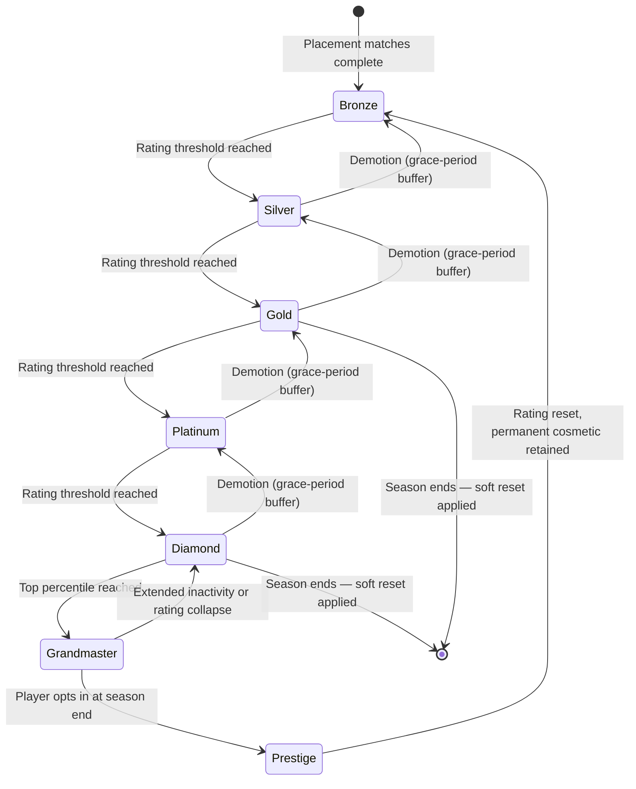

*Demotion includes a grace-period buffer (a small ratings cushion below the promotion threshold) — a deliberately player-friendly design choice, since punishing demotion too aggressively is a well-documented churn driver in competitive game design.*

---

## 18. Offline Expansion: Coding Arena Clubs

The offline layer is what separates "another coding practice app" from a genuine Chess.com-style category-defining brand. It is also, deliberately, a **Year 3+ initiative** — attempting offline expansion before the online product and rating system have real credibility would waste capital on empty events.

### 18.1 The Vision

Coding Arena Clubs are city- and campus-based chapters where the online rating and rank system extends into physical, in-person competitive events — local 1v1 arcades, campus tournament nights, and eventually city and national leagues feeding into a global championship. This mirrors the proven offline-expansion playbook of chess clubs, esports LAN events, and competitive-debate/Model UN circuits, all of which use an online or seasonal ranking system to give in-person events real stakes.

### 18.2 Expansion Phases

| Phase | Milestone | Description |
|---|---|---|
| **Phase 1 — City Chapters** | 10–15 Indian metro/Tier-2 chapters (Year 5 target) | Ambassador-led, initially hosted in partner colleges' existing spaces or co-working/café partnerships — minimal capex |
| **Phase 2 — College Ambassadors** | Formal ambassador program, one per partner campus | Recruits, trains, and equips student leaders (toolkit, budget, event templates) — the same acquisition motion described in [Section 10.6](#106-club-registration-flow) |
| **Phase 3 — Offline Competitions** | Monthly local tournaments per chapter | Physical LAN-style 1v1/team battles, feeding directly into the online rating system |
| **Phase 4 — Regional Championships** | Quarterly, multi-chapter regional events | First tier where travel and larger sponsorship becomes viable |
| **Phase 5 — National League** | Annual national season with promotion/relegation between city chapters | Mirrors traditional sports league structure — creates media and sponsorship narrative arcs |
| **Phase 6 — Annual Coding Arena World Cup** | Flagship international, broadcast event | The 10-year vision anchor point ([Section 28](#28-future-vision-10-years)) — the equivalent of Chess.com's Titled Tuesday-to-World-Championship pipeline, or the ICPC World Finals, but run and owned by Coding Arena |

### 18.3 Offline Revenue Model

| Line | Description |
|---|---|
| Chapter membership fees | Low-cost recurring fee for local chapter members (subsidized for student members) |
| Venue and corporate sponsorship | Local business/venue partnerships for chapter hosting; corporate sponsorship for regional/national events |
| Ticketed spectator events | Paid entry for larger regional/national finals, particularly once a broadcast/streaming angle exists |
| Merchandise at events | Physical retail tied to live events, a proven high-margin line at esports/chess events |
| Media and broadcast rights | Long-horizon (Year 7+) line once the National League and World Cup have real audience numbers |

### 18.4 Expansion Strategy Flow

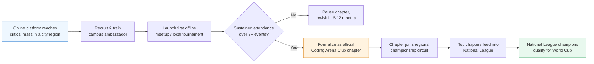

---

## 19. Financial Model

*All figures in this section are illustrative planning estimates built from standard early-stage startup benchmarks (India-based engineering team, global consumer product), not committed budgets or forecasts. They exist to give investors and the founding team a shared starting model to stress-test and replace with real vendor quotes, actual hiring costs, and real conversion data as soon as they exist. Claude is not a financial advisor, and nothing here should be treated as a guarantee of these outcomes — see [Appendix A](#appendix-a-assumptions) for the full assumption list.*

### 19.1 Cost Breakdown by Year

| Category | Year 1 | Year 2 | Year 3 |
|---|---|---|---|
| Engineering & Product headcount (~10 → ~32 → ~65 FTE, India-based blended fully-loaded cost) | $280K | $960K | $2.10M |
| Infrastructure (cloud, sandbox compute, CDN — scales with tournament-day peak load) | $40K | $200K | $480K |
| Marketing (ambassador program, contests, paid channels from Year 2) | $60K | $380K | $850K |
| Operations, legal, compliance, office/remote stipends | $50K | $180K | $340K |
| **Total Cost** | **$430K** | **$1.72M** | **$3.77M** |

### 19.2 Revenue Projection by Year

| Revenue Line | Year 1 | Year 2 | Year 3 |
|---|---|---|---|
| Premium subscriptions | – | $120K | $650K |
| Recruitment / B2B hiring | $10K (pilot) | $150K | $780K |
| Sponsored contests & brand collabs | $20K | $110K | $420K |
| College partnerships | – | $40K | $340K |
| Battle pass / cosmetics | – | $30K | $260K |
| Certification | – | – | $110K |
| Merchandise & events | – | – | $80K |
| **Total Revenue** | **$30K** | **$450K** | **$2.64M** |

### 19.3 Net Burn & Funding Need

| Metric | Year 1 | Year 2 | Year 3 |
|---|---|---|---|
| Total Cost | $430K | $1.72M | $3.77M |
| Total Revenue | $30K | $450K | $2.64M |
| **Net Burn** | **($400K)** | **($1.27M)** | **($1.13M)** |
| Cumulative capital required (with buffer) | ~$0.7–0.9M (pre-seed/seed) | ~$3.5–5M cumulative (Series A) | ~$7–9M cumulative (into Series B) |

### 19.4 Break-Even Analysis

Break-even is not modeled inside the 3-year window above — that is intentional and typical for a venture-scale consumer platform still building network effects and offline expansion optionality. Under the base-case model:

- **Break-even requires** roughly 250K–400K paying-equivalent users (premium + battle pass + B2B contract value combined) at the blended ARPU assumptions in [Section 7.3](#73-illustrative-unit-economics-year-2-target-b2c), against a cost base that has decelerated its *headcount* growth rate relative to revenue growth (i.e., the model assumes engineering headcount growth slows sharply after Year 3 while revenue continues compounding).
- **Realistic break-even horizon:** Year 4–5, contingent on the SOM trajectory in [Section 4.2](#42-tam-sam-and-som) holding — i.e., this is the same $18–42M ARR by Year 5 range restated as a profitability question rather than a revenue-size question.
- **The single most sensitive variable** is free-to-paid conversion. At LeetCode's benchmarked 3–5% range, the model above is achievable; at a more conservative 1–2% (plausible for a younger, more price-sensitive India-first cohort in early years), break-even likely slips 12–24 months and a larger Series B becomes necessary before profitability, not optional.

### 19.5 Three-Year Summary View

| | Year 1 | Year 2 | Year 3 |
|---|---|---|---|
| Registered users (cumulative, illustrative) | 50K | 450K | 2.2M |
| Paying-equivalent users | ~1K | ~15K | ~95K |
| Total Revenue | $30K | $450K | $2.64M |
| Total Cost | $430K | $1.72M | $3.77M |
| Net Burn | ($400K) | ($1.27M) | ($1.13M) |
| Headcount (FTE, year-end) | 10 | 32 | 65 |

---

## 20. Marketing Strategy

Given the illustrative CAC targets in [Section 7.3](#73-illustrative-unit-economics-year-2-target-b2c), the strategy is deliberately **organic- and community-led first**, with paid acquisition layered in only once the competitive core loop is proven to retain users — paying to acquire users into an unproven loop would be the fastest way to burn the seed round without learning anything.

### 20.1 Channel Strategy

| Channel | Tactic | Primary KPI |
|---|---|---|
| **Campus Ambassadors** | Student leaders run local sign-up drives, first College Battles, and Club chapter formation (same program as [Section 18](#18-offline-expansion-coding-arena-clubs)) | Registered users per campus, campus-to-campus battle participation rate |
| **Referral Program** | Existing users earn coins/cosmetics for successful invites, amplified during friend-challenge and team-formation flows | Viral coefficient (K-factor), referral-driven signups as % of total |
| **GitHub** | Open-source a lightweight problem-of-the-day widget/CLI tool developers can embed in their own repos or README | Developer-community signups, backlinks/brand mentions |
| **YouTube** | Sponsor and collaborate with existing competitive-programming and interview-prep YouTubers; publish battle highlight reels and "watch a live 1v1" content | Watch-time-to-signup conversion, channel subscriber growth |
| **Instagram / Short-form video** | Clip-worthy moments from live battles (comeback wins, buzzer-beater submissions) — the same content strategy that made chess and poker resurgent on social video | Share rate, follower growth, app-install attribution |
| **LinkedIn** | Placement-outcome storytelling ("How I used Coding Arena to prep for my Google interview"), College Battle results, recruiter-facing Company Battle case studies | B2B lead generation, recruiter sign-ups |
| **Influencers** | Partner with known competitive programmers (Codeforces red/orange-rank creators) and interview-prep content creators for sponsored battles and AMAs | Cost per acquired user by influencer tier |
| **SEO** | Problem-solution and "vs." comparison content (e.g., "Coding Arena vs. LeetCode") targeting interview-prep search intent | Organic search traffic, keyword ranking for high-intent terms |
| **Communities** | Active presence in existing Discord/Telegram competitive-programming and placement-prep communities; host community-run tournaments | Community-referred signups, community tournament participation |
| **Hackathons** | Sponsor and co-host university and company hackathons, using them as a live-demo environment for the battle format | Hackathon-attendee-to-registered-user conversion |

### 20.2 Acquisition Funnel

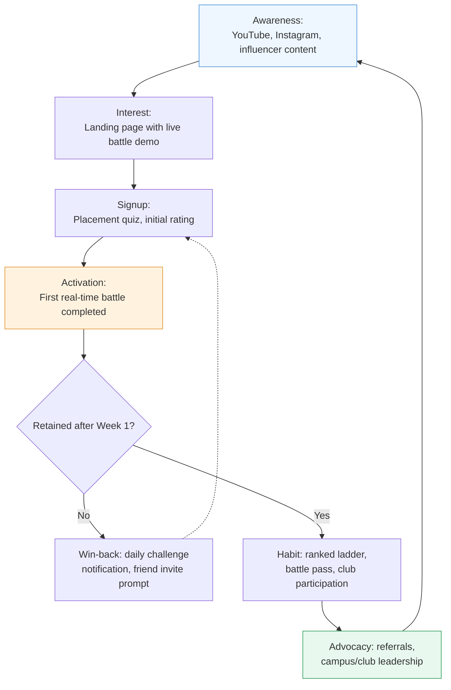

---

## 21. Risk Analysis

| Category | Specific Risk | Likelihood | Impact | Mitigation |
|---|---|---|---|---|
| **Technical** | Real-time judging infrastructure fails to hit fairness/latency bar at scale (e.g., one player's submission judged meaningfully faster than another's due to infra variance) | Medium | High — undermines the entire competitive-integrity premise | Heavy pre-launch load testing ([Section 14](#14-technology-stack)), synchronized problem-reveal and judging protocols, transparent latency SLAs published to users |
| **Legal** | Running paid tournaments with cash prizes may trigger gaming/gambling-adjacent regulation in some jurisdictions (India has a complex, state-by-state real-money-gaming regulatory landscape) | Medium | High — could block or delay the tournament-ticket revenue line | Legal review per jurisdiction before enabling cash-prize formats; launch with non-cash rewards (cosmetics, titles) first, add cash prizes only where cleared |
| **Financial** | Free-to-paid conversion undershoots the 3–5% benchmark, extending runway needs (modeled explicitly in [Section 19.4](#194-break-even-analysis)) | Medium-High | High | Conservative default planning scenario, staged hiring tied to revenue milestones rather than headcount targets |
| **Competition** | An incumbent (most plausibly HackerRank or LeetCode, given their capital) builds a real-time battle mode | Low-Medium | High — erodes the core differentiation | Speed to market, and building genuine network effects (ratings, club affiliations, social graph) that are costly for a challenger feature to replicate even if the mechanic is copied |
| **Execution** | Founding team lacks either deep competitive-programming credibility or real-time-systems engineering depth (or both) | Unknown (team-dependent) | High — this category punishes inauthenticity quickly, since the user base is technically sophisticated | Prioritize hiring/co-founder search explicitly against this gap before further fundraising |
| **Scaling** | Tournament-day traffic spikes (predictable but extreme) overwhelm sandbox capacity | Medium | Medium — degrades the flagship live-event experience specifically | Pre-warmed sandbox pools, load-tested autoscaling policies, graceful degradation plans (e.g., queueing with transparent wait-time display rather than failure) |
| **Security** | Sandbox escape vulnerability in the compiler execution layer (executing arbitrary untrusted user code is inherently high-risk) | Low-Medium | Very High — a breach here is a company-ending event, not a bug | Defense-in-depth container isolation, regular third-party security audits, aggressive resource/network restriction on every sandbox ([Section 11](#11-system-architecture)) |
| **Operational** | Offline Club expansion outpaces the ambassador program's ability to maintain quality/consistency across chapters | Medium | Medium | Phased, gated expansion criteria (Section 18.4) rather than growth-at-all-costs chapter opening |
| **Market** | India edtech investor sentiment remains cautious post-BYJU'S, making fundraising harder even for a fundamentally different (skill-verification, not tutoring-sales) business model | Medium | Medium | Lead fundraising narrative with outcome data and unit economics, explicitly differentiate from the tutoring-sales model that caused the correction |
| **AI disruption** | AI coding assistants make algorithmic interview screening itself obsolete as a hiring practice, shrinking the core "interview prep" motivation | Low-Medium (long-term) | High if realized | Product hedges into "live human performance under pressure" as the enduring value (a skill AI cannot substitute for on someone's behalf in a live, proctored setting) plus expansion into broader competitive/social entertainment value, not just interview utility |

---

## 22. SWOT Analysis

| **Strengths** | **Weaknesses** |
|---|---|
| Structurally differentiated core mechanic (real-time PvP) that no funded incumbent currently offers | Zero brand trust or rating-credibility at launch, in a category where earned credibility (à la Codeforces) matters enormously |
| Multi-line revenue model reduces single-point-of-failure risk relative to subscription-only or enterprise-only competitors | Real-time judging infrastructure is genuinely hard and expensive to build correctly — this is a strength if executed, a critical weakness if under-resourced |
| Clear, proven-elsewhere playbook to borrow from (Chess.com's freemium-competitive-to-offline-league arc) | India-first go-to-market means initial ARPU ceiling is lower than a US-first competitor could command |
| Explicit offline/community roadmap most competitors have never attempted | No existing user base, content library, or problem bank — starting from zero against incumbents with years of accumulated content |
| **Opportunities** | **Threats** |
| Skills-based hiring shift creates a growing, legitimate B2B budget line ([Section 4.5](#45-growth-trends-shaping-the-category)) | A well-capitalized incumbent (HackerRank, LeetCode) could build a competing real-time mode faster than Coding Arena can build a network-effect moat |
| AI commoditizing static problem-solving increases the relative value of live, unaided competitive performance | India-specific real-money-gaming regulation could complicate the tournament-prize revenue line ([Section 21](#21-risk-analysis)) |
| TopCoder's decline and CodeChef's weak monetization show real demand with no strong current owner of the "competitive" position | The category could remain a durably low-willingness-to-pay, practice-utility space rather than converting into an entertainment/competitive-gaming spend category, capping the SOM well below the modeled range |
| Genuine whitespace in offline competitive-coding events (no incumbent has any offline strategy) | Founding team credibility gap (competitive programming + real-time systems) is a real execution risk if not deliberately closed early |

---

## 23. PESTLE Analysis

| Factor | Analysis |
|---|---|
| **Political** | India's government-backed digital-skilling and AI-in-education initiatives (e.g., AI Centres of Excellence funding[15]) are a tailwind for institutional/B2G partnerships; state-level real-money-gaming regulation is a headwind requiring jurisdiction-by-jurisdiction legal review before enabling cash-prize tournaments. |
| **Economic** | India's edtech sector has moved from hype-driven VC funding to outcomes-driven scrutiny post-BYJU'S[14] — fundraising will require sharper unit-economics discipline than the 2020–2021 environment demanded, but genuine skill-verification products are explicitly identified as more resilient than tutoring-sales models. |
| **Social** | India's exam-competition culture (JEE/NEET/UPSC) creates strong cultural affinity for ranked, comparative competition as a legitimate form of "serious" education, not just entertainment — a genuine tailwind for adoption versus markets where self-paced learning is the dominant cultural norm. |
| **Technological** | Falling real-time infrastructure costs (managed Kubernetes, WebSocket gateways, serverless-adjacent compute) make a previously enterprise-only-affordable architecture viable for an early-stage startup; simultaneously, AI coding assistants are reshaping what "coding skill" even means, a double-edged trend addressed throughout Sections 15, 16, and 21. |
| **Legal** | Data privacy compliance (India's DPDP Act, plus GDPR for any EU users) applies to profile, behavioral anti-cheat, and payment data; real-money tournament formats face the gaming-regulation complexity noted above; employment-adjacent recruiting features must avoid discriminatory-screening liability (an AI-scored hiring signal carries real compliance weight in several jurisdictions). |
| **Environmental** | Modest but real: compiler-sandbox compute at scale has a non-trivial energy footprint; offline events (Section 18) carry standard event-logistics environmental considerations. Neither is a first-order strategic risk for a company at this stage, but both are worth a stated position for enterprise/sponsor partners who screen for it. |

---

## 24. Lean Canvas

| Block | Content |
|---|---|
| **Problem** | (1) Solo practice is demotivating and doesn't build interview-realistic pressure tolerance; (2) existing competitive formats are scheduled and impersonal, not on-demand and matched; (3) no platform gives coding a portable, defensible competitive identity the way chess or ranked games do |
| **Customer Segments** | CS students & early-career engineers (primary); colleges/placement cells (institutional buyer); employers/recruiters (B2B buyer); competitive programmers (prestige-seeking power users) |
| **Unique Value Proposition** | The only platform where practicing and competing are the same real-time action — the Chess.com of Coding |
| **Solution** | Real-time matched battles across 1v1/team/college/company formats, multi-axis live scoring, a portable competitive rating, and an explicit offline club roadmap |
| **Channels** | Campus ambassadors, referral program, GitHub/YouTube/Instagram/LinkedIn content, competitive-programming communities, hackathon sponsorships |
| **Revenue Streams** | Premium subscription, battle pass, recruitment/B2B, sponsored contests, college partnerships, offline clubs, certification, merchandise, API licensing |
| **Cost Structure** | Engineering headcount (dominant, especially real-time infra + judge), cloud/compute (spiky, tournament-driven), marketing (organic-first), offline event operations (Year 3+) |
| **Key Metrics** | Weekly active battlers, free-to-paid conversion, Day-30 retention (competitive vs. solo cohort), tournament participation rate, B2B contract value ([full KPI dashboard: Section 27](#27-kpi-dashboard)) |
| **Unfair Advantage** | Network effects compounding across three layers simultaneously — social graph (friends/teams), institutional identity (college/company), and a defensible rating history — that are each individually hard and collectively very hard for a challenger to replicate quickly |

---

## 25. Business Model Canvas

| Block | Content |
|---|---|
| **Key Partners** | Colleges/placement cells, employer recruiting teams, payment processors (Razorpay/Stripe), cloud infrastructure providers, competitive-programming influencers/communities, event/venue partners for offline expansion |
| **Key Activities** | Real-time judging platform development, problem-set curation and quality control, matchmaking/ranking algorithm tuning, anti-cheat operations, community and ambassador program management, tournament production |
| **Key Resources** | Real-time judging & matchmaking infrastructure (core technical asset), problem bank, the competitive rating dataset itself (a compounding data asset), brand/community trust, ambassador network |
| **Value Propositions** | For students: real-time competitive practice that's actually fun and interview-realistic. For colleges: engagement and placement-prep tooling with visible outcomes. For employers: a candidate pool pre-filtered and ranked by verifiable live performance, with better candidate experience than status-quo assessment tools |
| **Customer Relationships** | Self-serve for individual users; managed/dashboard relationship for college and enterprise accounts; community-led (ambassadors, Discord/Telegram presence) for engagement and retention |
| **Channels** | In-app, web, mobile; campus ambassador network; direct B2B sales for enterprise/college accounts; organic social and creator partnerships |
| **Customer Segments** | Individual B2C users (students, early-career engineers, competitive programmers); B2B2C (colleges); B2B (employers/recruiters, sponsors) |
| **Cost Structure** | Engineering/infrastructure (largest line), marketing, operations, offline event costs (later stage) |
| **Revenue Streams** | Full 13-line model detailed in [Section 7.1](#71-revenue-streams) |

---

## 26. Go-To-Market Strategy

### 26.1 Phased Launch Plan

| Phase | Timing | Focus | Success Criteria to Advance |
|---|---|---|---|
| **Closed Beta** | Pre-launch, ~8–12 weeks | 3–5 partner colleges, invite-only, core 1v1 battle format only | Battle completion rate >80%, qualitative signal that competitive format beats solo practice on self-reported motivation |
| **Public Beta** | Post-closed-beta | Open signups, expand to 2v2/Team formats, first Daily Challenges | Week-1 retention benchmark met (specific target set from closed-beta baseline), no critical judging-fairness incidents |
| **Early Adopters** | Months 1–6 post-launch | Campus ambassador program scales to 15–25 colleges, first sponsored Company Battle | Organic referral share of signups exceeds paid/owned channels |
| **Growth** | Months 6–18 | Premium tier + Battle Pass launch, Tournament Mode, paid marketing layered in cautiously | CAC:LTV ratio holds above target ([Section 7.3](#73-illustrative-unit-economics-year-2-target-b2c)) as paid spend scales |
| **Expansion** | Year 2–3 | College Partnerships product, certification, first non-India market | Unit economics proven in India before capital committed to a second market |
| **Internationalization** | Year 3+ | Southeast Asia, then global English-speaking markets | Localization limited to language/payment rails first — format and mechanics stay constant, since the core loop is not culturally India-specific |

### 26.2 Go-To-Market Flow

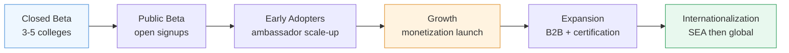

---

## 27. KPI Dashboard

| KPI | Definition | Why It Matters Here |
|---|---|---|
| **Daily Active Users (DAU)** | Unique users completing at least one meaningful action per day | Baseline engagement health |
| **Weekly Active Battlers** | Unique users completing at least one live battle per week | The single most important metric — measures whether the *core competitive mechanic*, not just app opens, is sticky |
| **Day-1 / Day-7 / Day-30 Retention** | % of new users returning at each interval | Tracked separately for "played ≥1 real-time battle in first session" vs. "did not," to directly test the core product hypothesis from Section 2–3 |
| **Free-to-Paid Conversion Rate** | % of active users converting to any paid product (subscription, battle pass, cosmetics) | Primary driver of the financial model in Section 19 |
| **Revenue (by line)** | Tracked per the 13 streams in [Section 7.1](#71-revenue-streams) | Validates or invalidates the multi-line revenue thesis over time |
| **CAC (by channel)** | Fully-loaded acquisition cost per registered user, per channel | Tests whether the organic-first strategy in Section 20 is holding |
| **LTV** | Projected lifetime revenue per user cohort | Paired with CAC for the core unit-economics health check |
| **Churn Rate** | % of paying users lapsing per month | Early warning for battle-pass/season fatigue or competitive-balance issues |
| **Battle Completion Rate** | % of started battles that reach a scored conclusion (vs. abandoned/disconnected) | Direct proxy for judging-infrastructure reliability and matchmaking quality ([Section 11](#11-system-architecture), [21](#21-risk-analysis)) |
| **Average Match Time** | Median time from queue entry to battle start | Matchmaking-quality signal; excessive wait times are a primary churn risk in any PvP product |
| **Tournament Participation Rate** | % of eligible/active users entering a given tournament | Measures whether the "event" layer (Section 10.3, 18) is actually driving engagement beyond the core ladder |
| **Net Promoter Score (NPS)** | Standard willingness-to-recommend survey metric | Leading indicator for the organic/referral growth channel's health |
| **B2B Contract Value & Renewal Rate** | Total and per-contract recruitment/college-partnership revenue, plus renewal % | Validates the enterprise side of the business model independent of consumer metrics |

---

## 28. Future Vision (10 Years)

By its tenth year, Coding Arena's stated ambition is to have done for competitive coding what Chess.com did for chess and what the ATP/major esports leagues did for their respective competitive scenes — not just a bigger app, but a **recognized global sport with a real career and cultural pathway underneath it.**

| Dimension | 10-Year Ambition |
|---|---|
| **Global tournaments** | A full annual calendar of regional and international tournaments, culminating in the Coding Arena World Cup, with meaningful prize pools and mainstream tech-media coverage |
| **Professional coding leagues** | Sponsored, salaried competitive "teams" (mirroring esports orgs) fielding rosters in national/international league play |
| **University partnerships** | Coding Arena Rating recognized as a formal signal in university CS admissions/placement processes in partner institutions, alongside grades and portfolios |
| **Company hiring ecosystem** | A critical mass of employers treating Company Battles and rating-verified profiles as a standard, trusted part of the technical hiring funnel — not a novelty channel |
| **Scholarships** | A Coding Arena Foundation or equivalent funding scholarships and free Premium access for top-performing students from under-resourced backgrounds, funded by tournament/sponsorship revenue |
| **Coding stadiums** | Purpose-built or repurposed venues hosting live, spectated national/regional finals — the physical endpoint of the offline roadmap in Section 18 |
| **Offline clubs in major cities** | A mature multi-country club network, following the same city-chapter-to-national-league model piloted in India, replicated market by market |
| **International championships** | Country-vs-country team formats (an "ICPC meets the Ryder Cup" format), building the same national-pride engagement that drives chess Olympiad and World Cup viewership |
| **AI-powered coaching** | AI Coach evolved into a genuinely personalized, longitudinal coding mentor — tracking a user's growth from their first battle through years of competitive history |
| **Developer social network** | Coding Arena profiles function as a recognized professional identity layer for developers — the rating and battle history become a legitimate complement to (not replacement for) a GitHub profile or resume |

---

## 29. Final Verdict: Brutally Honest Evaluation

*Every section above is written in the confident, structured register investors expect from a blueprint. This section deliberately drops that register. It is the section a good advisor would deliver over coffee, not in the deck.*

### 29.1 Does this have venture-scale potential?

**Maybe — but the honest answer is "not obviously, and the best available comp argues against it."** Chess.com is the comp this entire document leans on, and it is worth sitting with what Chess.com actually is: a company that took roughly **twenty years** to reach ~$150M in revenue, was **bootstrapped with no outside venture funding for the vast majority of its life** (a private-equity stake only arrived in 2021, well after profitability was established), and monetizes a game with a thousand-plus years of cultural legitimacy, near-universal rule literacy, zero language barrier, and an Olympiad/World-Championship structure that already existed before the internet did.[1],[30] Coding Arena is proposing to do the same thing for a "game" that (a) requires substantial domain expertise to even understand what's happening in a battle, (b) has zero pre-existing cultural cachet as *entertainment* rather than *career utility*, and (c) has a category history — CodeChef's ~$3.8M revenue against a 2M+ user base after 15+ years, TopCoder's visible decline, Codeforces' total absence of a business model — that reads less like "untapped goldmine" and more like "several capable teams have tried to monetize this exact niche and the ceiling has, so far, been low."[2],[3]

That is not a reason not to build this. It is a reason to be precise about *which* business is being built. There are two different companies hiding inside this document:

1. **A profitable, capital-efficient, niche-but-real business** (think: $10–40M ARR, strong margins, a respected brand in a defined category) — this looks achievable with disciplined execution and is arguably the *base case* if the core mechanic works at all.
2. **A venture-scale, category-defining "sport"** (the 10-year World Cup vision in Section 28) — this is possible but requires the offline/league/broadcast layer to work, and that layer is a fundamentally different, historically difficult business (most traditional and esports leagues lose money for a decade or more even with large, engaged audiences; audience size and league profitability are not the same thing).

A founding team and investor group should explicitly agree on which of these two they are underwriting, because the fundraising strategy, hiring plan, and burn rate should look very different depending on the answer.

### 29.2 The Five Biggest Risks, Ranked

1. **The core hypothesis is genuinely untested.** Nothing in this document proves that a live opponent makes coding practice more effective or more retained — it's a strong, well-argued analogy to chess and gaming, not evidence. This must be the very first thing validated (see 29.3), and if it's false, the rest of the document is moot.
2. **This exact niche has a proven monetization ceiling.** CodeChef and Codeforces are not hypothetical failed attempts at "a coding platform" — they are the closest possible comps to the *competitive coding specifically* piece of this pitch, and neither has cracked meaningful consumer monetization after over a decade each. Coding Arena's answer (gaming-style monetization, B2B recruiting, offline events) is a reasonable hypothesis for *why it will be different*, not a proven fact that it will be.
3. **Real-time judging fairness is a hard, unforgiving technical bar**, being attempted by (presumably) a small early team, for an audience of professional software engineers who will notice and publicly discuss every latency inconsistency or judging bug — this is close to the least forgiving possible user base for early technical rough edges.
4. **Founder-market fit is currently a blank in this document.** Investors will weight this above almost everything else written here. A blueprint, however thorough, is not a substitute for evidence that the founding team has either lived inside competitive programming culture or has shipped real-time/matchmaking systems before (ideally both).
5. **The AI trend is a genuine double-edged sword, not a clean tailwind.** This document frames AI-commoditization of static problem-solving as validating live competitive formats — a real and defensible argument — but the equally plausible counter-scenario is that algorithmic-interview screening itself declines in importance over the same period as hiring shifts toward AI-collaborative or system-design evaluation, shrinking the "interview prep" motivation this product currently leans on most heavily.

### 29.3 Milestones That Would Actually Validate This

Ranked by how early and how cheaply each can be tested — deliberately not vanity metrics (total signups, app downloads, press mentions):

| # | Milestone | Why It's the Real Test |
|---|---|---|
| 1 | In a closed beta, users who play ≥1 real-time battle in session one retain measurably better at Day-7/Day-30 than a solo-practice control group | This is the entire product thesis in one measurable comparison — if this doesn't hold, no amount of gamification or marketing fixes it |
| 2 | Unprompted organic referral behavior (users inviting friends specifically to battle them, not generic app-share) | Tests whether the social/competitive hook is real or merely plausible-sounding |
| 3 | A meaningful cohort converts to paid *without* aggressive discounting, at anything close to modeled conversion rates | Tests willingness-to-pay directly, the single most financially load-bearing assumption in Section 19 |
| 4 | At least one B2B recruiting or college-partnership contract renews (not just pilots once) | Distinguishes "a company was willing to try a free/cheap pilot" from "this is a budget line a company actually values" |
| 5 | Students reference their Coding Arena Rating unprompted outside the platform (resumes, LinkedIn, casual conversation) | The clearest possible signal that the "portable competitive credential" thesis — the thing that would make this defensible long-term — is becoming real rather than aspirational |

### 29.4 Probability of Success Under Different Execution Scenarios

*These figures are directional judgment calls, not a calculated statistical output — treat them as a structured opinion to argue with, not a forecast. "Success" is split into two bars because, per Section 29.1, they are different outcomes with different implications.*

| Execution Quality | P(shuts down / fails within ~3 years) | P(becomes a solid, sustainable niche business — roughly Chess.com's early trajectory or CodeChef-plus) | P(reaches genuine venture-scale / category-defining outcome) |
|---|---|---|---|
| **Poor** (generic execution, weak technical bar, no founder credibility in the space, treats sections of this doc as a checklist rather than hypotheses to test) | ~65–75% | ~20–25% | ~2–5% |
| **Average** (competent team, adequately funded, hits most roadmap milestones roughly on schedule, normal startup execution quality) | ~35–45% | ~40–45% | ~10–15% |
| **Excellent** (genuine founder-market fit, nails the real-time technical bar, achieves organic/community credibility early, disciplined about capital, treats Section 29.3's milestones as hard gates before scaling spend) | ~15–20% | ~45–55% | ~25–35% |

### 29.5 The Bottom Line

Build this if the founding team has (or can quickly acquire) genuine standing in competitive programming culture and genuine depth in real-time systems — the two hardest-to-fake, most load-bearing assumptions in this entire document. If both are true, this is a legitimate, well-reasoned opportunity sitting in a category with proven user demand and a real, structural product gap that no funded incumbent has closed. If neither is true, this document is an excellent business-planning exercise attached to a product that will be very hard to build credibly, in a market that has already shown two capable competitors (CodeChef, TopCoder) a low monetization ceiling. The honest recommendation is: **run the Section 29.3 milestones as a scrappy, cheap validation phase before raising or spending against the full 28-section vision above** — the vision is coherent and worth building toward, but it should be earned in that order, not assumed.

---

## Appendix A: Assumptions

This document makes assumptions throughout that a founding team or investor should explicitly challenge, verify, or replace with real data as it becomes available. Isolating them here (rather than only inline) is meant to make the document easier to audit and update.

### A.1 Market Sizing Assumptions
- No analyst-tracked market report exists for "real-time competitive coding platforms" specifically; TAM/SAM/SOM in Section 4 are constructed by triangulating adjacent, analyst-tracked segments (top-down) against developer-population and comparable-platform economics (bottom-up). Treat both as directional, not certified.
- The ~18–22M "globally engaged" user-pool estimate underlying SAM assumes meaningful de-duplication across LeetCode/HackerRank/CodeChef/Codeforces/TopCoder/AtCoder user bases, which is not independently verifiable from public data and should be treated as an order-of-magnitude estimate.
- India EdTech figures cited range from ~$3.6B to ~$13B depending on methodology and what counts as "EdTech" (D2C-only vs. broader institutional spend); this document uses the IBEF/Grant Thornton Bharat figures (~$7.5B current, ~$29–30B by 2030) as the primary anchor but flags the wide variance across sources.

### A.2 Competitor Data Assumptions
- LeetCode's user count (~15M+) and revenue (~$100M+) are third-party estimates, since LeetCode does not publicly disclose financials; treat as directional, not audited figures.
- CodeChef's disclosed revenue (₹32.1 Cr / ~$3.8M, FY2025) is sourced from a third-party company-intelligence platform (Tracxn), not CodeChef's own public financial disclosure.
- HackerRank's "26 million developer community" figure is drawn from HackerRank's own published content and should be understood as a cumulative registered-account figure, not a monthly/weekly active-user count.

### A.3 Financial Model Assumptions (Section 19)
- Headcount costs assume an India-based, blended fully-loaded average cost per FTE that will vary significantly by actual seniority mix — the real-time infrastructure work in particular likely requires senior engineers priced above this blended average.
- Free-to-paid conversion (3–5%) is benchmarked against LeetCode's *estimated* range, itself an unverified third-party figure (see A.2) — this is the single most sensitive and least-verified assumption in the entire model.
- No specific funding round size, valuation, or investor terms are assumed or implied anywhere in this document; capital-required figures are burn-based estimates only.
- All financial figures are presented in USD for comparability; an India-first company would in practice manage most costs in INR, introducing currency and inflation variables not modeled here.

### A.4 Timeline Assumptions
- The Section 8 and 18 roadmaps assume a fundraising close and build start around Q3 2026; every downstream date is relative to that anchor and should shift with actual fundraising timing.
- Offline expansion (Section 18) is explicitly sequenced after online product-market fit signals, not in parallel — this is a deliberate recommendation, not a prediction of what a founding team will actually choose to do.

### A.5 Team and Execution Assumptions
- This document assumes, but cannot verify, that a capable engineering and product team can be assembled or already exists; Section 29 treats founder-market fit as an open, unscored variable precisely because this document has no visibility into the actual founding team's background.
- Legal/regulatory assumptions (Section 21, 23) are general observations, not legal advice; India's real-money-gaming regulatory landscape in particular is state-specific and evolving, and any tournament-prize feature should be reviewed by qualified legal counsel before launch.

---

## Appendix B: References

Figures and claims throughout this document are drawn from the following sources (accessed July 2026). Several figures (particularly private-company revenue and user counts) are third-party estimates rather than audited disclosures — see Appendix A for specific caveats.

1. Chess.com user/revenue figures — Yahoo Finance / Adweek, "Chess.com Surpassed 250 Million Users And Is Launching a New Advertising Gambit" (April 2026); Adweek, "Chess.com Passes 250 Million Users, Launches Its Ads Gambit" (April 2026)
2. CodeChef revenue and company profile — Tracxn, "CodeChef - 2026 Company Profile"
3. TopCoder participation decline — Codeforces community blog, "What happened to Topcoder?" (2026)
4. India EdTech market sizing — IBEF (India Brand Equity Foundation), "Education in India: Higher Education Trends & Index"
5. Technical/mock interview platform market sizing — Verified Market Reports, "Technical Interview Platform Market" and "Mock Interview Platforms Market"
6. Interview preparation tool market sizing — Verified Market Research, "Interview Preparation Tool Market"; Data Insights Market, "Interview Preparation Tool Market Ecosystem"
7. Coding bootcamp market sizing — Coherent Market Insights, "Coding Bootcamp Market Size, Trends & YoY Growth Rate, 2033"
8. Programming software market sizing — Research and Markets, "Programming Software Market Global Report 2026"
9. Global EdTech market sizing — Grand View Research, "Education Technology Market Size, Share Report, 2026–2033"; Technavio, "Edtech Market Growth Analysis 2026–2030"
10. India EdTech market sizing (secondary anchor) — IBEF (see also ref. 4)
11–13. Developer population and platform user-base figures — Colorlib, "60+ Web Development Statistics & Trends (2026)"; Keyhole Software, "Software Development Statistics: 2026 Market Size"; various platform-specific sources below
14. India EdTech market correction analysis — RAYSolute, "Indian EdTech Market 2026: BYJU'S Collapse, PhysicsWallah's Rise & 2035 Forecast"
15. India government AI-in-education budget allocation — IBEF (see ref. 4)
16. LeetCode Premium pricing — LeetCode official subscription page; Japture, "LeetCode Premium 2025: Pricing, Discounts, Worth"
17. AI coding tool adoption statistics — CompaniesHistory.com, "Software Development Market Statistics 2026"
18. Skills-based hiring adoption statistics — HackerRank, "HackerRank vs. HackerEarth: Choosing the Right Technical Assessment Platform"
19. AI interview agent product features — HackerEarth, "HackerRank vs HackerEarth: Which Wins Coding Interviews?"
20. Codeforces user statistics — Wikipedia, "Codeforces"
21. CodeChef user statistics and acquisition history — Varindia, "Unacademy completes acquisition of CodeChef"; Wikipedia, "CodeChef"
22. HackerRank developer community and enterprise customer figures — HackerRank, "HackerRank vs HackerEarth: Evaluation Software for AI Skills Migration"
23. HackerEarth company background — Truffle, "HackerEarth vs HackerRank (2026 comparison)"
24. TopCoder membership figures — daily.dev, "Best Competitive Programming Communities"
25. InterviewBit/Scaler Academy relationship — Codeforces community blog, "Scaler Academy: Our side of the story: AMA" (co-founder statement)
26. HackerRank candidate-experience criticism — Capterra, "HackerRank Software Pricing, Alternatives & More 2026"
27. HackerEarth AI interview product (OnScreen) — HackerEarth blog (see ref. 19)
28. TopCoder UX/adoption analysis — Medium, "Why Codeforces has Beaten Topcoder"
29. InterviewBit/Scaler founder background — Codeforces community blog (see ref. 25)
30. Chess.com company history — Wikipedia, "Chess.com"

*All web sources were accessed via search in July 2026 and reflect publicly available information as of that date; private-company financial and user figures not independently disclosed by the companies themselves should be treated as third-party estimates. This document does not constitute financial, legal, or investment advice.*

---

**— End of Document —**

*Coding Arena Startup Blueprint · v1.0 · July 2026*

